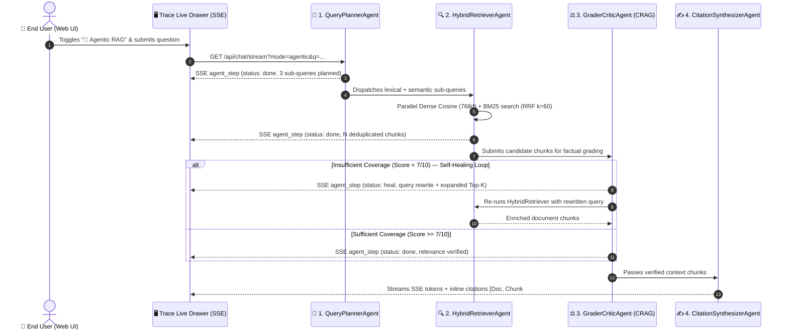

> 🇫🇷 **[Version Française](README.md)** | 🇬🇧 **[English Version](README-EN.md)** | 🎬 **[Step-by-Step Demo Playbook (DEMO_PLAYBOOK-EN.md)](docs/DEMO_PLAYBOOK-EN.md)** | 🚀 **[Live Demo](https://rag.hoffmannw.demo.altostrat.com)**

# RAG Comparison Demo

[](https://go.dev/)
[](https://cloud.google.com/vertex-ai)
[](https://ai.google.dev/)
[](LICENSE)

Technical demonstration web application comparing keyword-based lexical search with grounded Retrieval-Augmented Generation (RAG) using the Google Gemini 3 model family on Vertex AI.

The application runs as a standalone Go binary compiled with zero external dependencies (`0 dependencies`, `0 CVEs`). It is deployed on **Google Cloud Run** or **Google Kubernetes Engine (GKE) Autopilot** as part of the [GCP AI Foundation Blueprint](https://github.com/cloud-gtm/gcp-ai-foundation-blueprint) architecture.

---

## Features

### 1. Hybrid Search (Semantic & Lexical)
- **Dense embeddings**: Vectorization using the Vertex AI `text-multilingual-embedding-002` model (768-dimensional vectors).
- **Native Go cosine similarity**: High-performance in-memory vector comparison without external vector databases or CGO dependencies.
- **Combined ranking**: Weighted scoring formula $0.65 \times \text{CosineSimilarity} + 0.35 \times \text{LexicalScore}$ (normalized BM25).
- **Automatic fallback**: If the Vertex AI Embedding API is unreachable or rate-limited, the engine automatically falls back to full lexical search with linguistic normalization (accent folding, French elision handling, stop words filtering).

### 2. Gemini 3 Model Suite & Multi-Model Arena
- **Supported models**:
  - `gemini-3.5-flash` (default): Ultra-low latency, high throughput, and native multimodal reasoning.
  - `gemini-3.8-flash`: Frontier agentic capabilities and code-level technical reasoning.
  - `gemini-3.1-pro-preview`: Deep reasoning model for complex architectural analysis and dense synthesis.
  - `gemini-3.5-flash-lite`: High-frequency, cost-sensitive operational workloads.
- **Dynamic model switching**: Hot-swap active models via `/api/model/switch` without container restarts.
- **Display modes (5 interactive views)**:
  - **Standard RAG**: Unified grounded response with retrieved source cards and telemetry.
  - **Split View**: Direct side-by-side comparison between raw lexical excerpts and grounded RAG synthesis.
  - **Model Arena (Dual-Model)**: Concurrent side-by-side inference with two distinct Gemini models on the exact same query.
  - **Triple View**: Three-column comparison (Model A, Model B, Classical Lexical Search).
  - **🤖 Agentic RAG (4-Subagent CRAG Swarm)**: Self-correcting multi-agent pipeline (`QueryPlanner` ➔ `HybridRetriever` ➔ `GraderCritic` with *Auto-Heal* loop ➔ `CitationSynthesizer`) paired with a live **Trace Live** SSE drawer (`event: agent_step`).
- **Real-time telemetry**: In-stream tracking of time-to-first-token (TTFT in ms), total generation latency, and exact token counts parsed from Vertex AI responses.

### 3. On-Demand GenAI Evaluation (Vertex AI Autorater)
- **Unit-level evaluation**: Interactive evaluation button under every generated model response.
- **Calculated metrics**:
  - **Groundedness**: Measures factual alignment between the generated response and the retrieved document chunks (rating from 1 to 5).
  - **QA Relevance**: Evaluates how well the response directly addresses the user's query (rating from 1 to 5).
- **Inspection reports**: Interactive modal displaying numerical ratings, textual rationale produced by the Vertex AI Autorater, and exact contextual excerpts evaluated.
- **Heuristic fallback**: In offline or sandbox environments without Rapid Evaluation quotas, a deterministic n-gram overlap heuristic provides continuous feedback.

### 4. Cloud Storage Persistence & Horizontal Scaling
- **Serialized index**: Uploaded documents and their embeddings are persisted as JSON snapshots in `gs://{GCS_RAG_BUCKET}/index/corpus.json`.
- **Multi-instance support**: Cloud Run instances scale horizontally (`--max-instances=5`) with consistent corpus synchronization.
- **Instant cold starts**: Snapshots are restored from GCS in under one second during instance startup.

---

## Architecture

Review the complete architectural diagram in GCP Draw format in [docs/architecture-gcpdraw.md](docs/architecture-gcpdraw.md).

```
                            [ Client Browser ]
                                     │
                   HTTPS / Identity-Aware Proxy (IAP)
                                     │
                                     ▼
                     [ Google Cloud Load Balancer ]
                                     │
                                     ▼
                     [ Cloud Run : rag-comparison ]
                     ┌────────────────────────────┐
                     │ • Native Go HTTP Server    │
                     │ • Hybrid Search Engine     │
                     │ • 4-Subagent CRAG Swarm    │
                     │ • Static Assets (embed.FS) │
                     └──────┬──────────────┬──────┘
                            │              │
           Vectorization &  │              │  Corpus Storage
           LLM Inference    │              │  & Snapshots
                            ▼              ▼
                    [ Vertex AI ]    [ Cloud Storage ]
                    • Gemini 3.5/3.8 • gs://{BUCKET}/index/
                    • Embeddings 002
                    • Rapid Eval
```

---

## REST API Reference

All endpoints are served by the Go HTTP server on the configured port (`PORT`, default `8080`).

| Method | Endpoint | Parameters | Description |
| :--- | :--- | :--- | :--- |
| `GET` | `/api/documents` | None | Returns the list of all indexed documents and metadata (title, size, chunks). |
| `POST` | `/api/documents/upload` | Multipart form (`files[]`) | Uploads and indexes new documents (PDF, text, markdown) with embeddings. |
| `DELETE` | `/api/documents?id={id}` | `id` (document ID) | Deletes a document from the corpus and updates the Cloud Storage snapshot. |
| `DELETE` | `/api/documents?all=true` | `all=true` | Purges all documents from memory and removes the Cloud Storage snapshot. |
| `GET` | `/api/search/classic` | `q={query}` | Performs keyword-based lexical search and returns raw snippet excerpts. |
| `GET` | `/api/chat/stream` | `q={query}`, `model={model_id}`, `mode=agentic` *(opt.)* | Streams grounded RAG or 4-subagent CRAG responses via Server-Sent Events (`event: agent_step`, `retrieval`, `token`, `metrics`). |
| `GET` | `/api/models` | None | Lists available Gemini models, specifications, and the active default model. |
| `POST` | `/api/model/switch` | JSON body `{"model": "id"}` | Dynamically changes the active default Gemini model. |
| `POST` | `/api/evaluate` | JSON body `{"query", "prediction", "context"}` | Runs an evaluation for Groundedness and QA Relevance via Vertex AI Rapid Evaluation. |
| `GET` | `/healthz` | None | Liveness and readiness health check probe for Cloud Run and Kubernetes. |

---

## Environment Variables

Configure application behavior using the following environment variables:

| Variable | Type | Default | Description |
| :--- | :--- | :--- | :--- |
| `GCP_PROJECT` (or `PROJECT_ID`) | String | Auto-detected via GCP metadata | Google Cloud project ID hosting Vertex AI. |
| `GCP_REGION` (or `REGION`) | String | `europe-west1` | Target Google Cloud region for regional Vertex AI calls. |
| `GEMINI_MODEL` | String | `gemini-3.5-flash` | Default Gemini model configured at startup. |
| `GCS_RAG_BUCKET` | String | None (optional) | Cloud Storage bucket name for corpus snapshot persistence (`corpus.json`). |
| `PORT` | Integer | `8080` | TCP port on which the HTTP server listens. |

---

## Local Development

### Prerequisites
- Go 1.25 or higher installed.
- Google Cloud SDK (`gcloud`) authenticated with access to a Google Cloud project.
- Required IAM roles: `roles/aiplatform.user` and `roles/storage.objectAdmin`.

### Run Locally

```bash
# 1. Navigate to the source directory
cd src

# 2. Set environment variables (GCP_PROJECT or PROJECT_ID)
export GCP_PROJECT=$(gcloud config get-value project)
export GCP_REGION="europe-west1"
export GEMINI_MODEL="gemini-3.5-flash"
export GCS_RAG_BUCKET="${GCP_PROJECT}-rag-docs"

# 3. Run unit tests
go test -v ./...

# 4. Start the server
go run main.go
```

Access the web interface at `http://localhost:8080`.

---

## Deployment

Refer to the [Deployment Guide](docs/DEPLOYMENT_GUIDE.md) for step-by-step production deployment procedures.

### Option 1: Google Cloud Run (Serverless)

```bash
./deploy/cloudrun/deploy.sh
```

### Option 2: GKE Autopilot (GCP AI Foundation Blueprint)

```bash
./scripts/deploy-to-blueprint.sh --blueprint-dir=../gcp-ai-foundation-blueprint
```

---

## Security & Governance

- **Zero hardcoded credentials**: The container image contains no service account keys or static secrets. Authentication is managed exclusively through **Workload Identity** (GKE) and Cloud Run execution service accounts via instance metadata (`http://metadata.google.internal`).
- **Network perimeter protection**: Recommended deployment with `--ingress=internal-and-cloud-load-balancing`, protected by Cloud Armor WAF and Identity-Aware Proxy (IAP).
- **Zero third-party runtime dependencies**: The Go backend imports only the Go standard library (`0 direct dependencies`, `0 CVEs` in container vulnerability scans).

---

## 🤖 Dual-Layer Agentic Architecture (Runtime CRAG Swarm & M1L1 Skills)

This repository implements a **two-tier complementary Agentic AI architecture**:
- 🚀 **Layer 2 (Production Run-Time)**: A **4-Subagent Corrective RAG (CRAG) Swarm** embedded natively inside the Go binary (`src/main.go`), triggered in real time by end users from the web UI.
- 🛠️ **Layer 1 (Engineering Build-Time)**: **2 Specialized Subagents and 1 M1L1 Skill** (`.agents/`), triggered inside the IDE/CLI during code development and before every `git commit`.

### 🔄 Sequence Diagram: How the 4 CRAG Subagents Enter into Action Live

When a user clicks the **`🤖 Agentic RAG`** button in the web interface (`https://rag.hoffmannw.demo.altostrat.com`) and submits a question, the backend streams each subagent's execution live over SSE (`event: agent_step`) into the **Trace Live** drawer:



### 📊 Summary Matrix: Where and How Each Agent Operates

| Agent / Skill | Layer | Where does it live? | How / When does it enter into action? | Role & Added Value |
| :--- | :--- | :--- | :--- | :--- |
| **`QueryPlannerAgent`** | **Layer 2** *(Run-Time)* | `src/main.go` (`runAgenticRAGPipeline`) | **Step 1** as soon as a query is submitted in `🤖 Agentic RAG` mode. | Decomposes complex, multi-faceted user questions into targeted lexical and semantic sub-queries. |
| **`HybridRetrieverAgent`** | **Layer 2** *(Run-Time)* | `src/main.go` (`runAgenticRAGPipeline`) | **Step 2** after query planning (and re-invoked during *Auto-Heal*). | Executes parallel **Dense Cosine + Sparse BM25 with Reciprocal Rank Fusion ($k=60$)** and deduplicates chunks. |
| **`GraderCriticAgent`** | **Layer 2** *(Run-Time)* | `src/main.go` (`runAgenticRAGPipeline`) | **Step 3** prior to any final LLM generation. | Grades chunk relevance (`/10`). Automatically triggers a **Self-Correction (Query Rewrite)** loop if coverage is insufficient. |
| **`CitationSynthesizerAgent`** | **Layer 2** *(Run-Time)* | `src/main.go` (`runAgenticRAGPipeline`) | **Step 4** once chunks are certified by `GraderCriticAgent`. | Streams the grounded synthesis over SSE with inline citations `[Doc: <Title>, Chunk #X]` and triggers Vertex AI Autorater evaluation. |
| **[`rag-eval-scientist`](.agents/agents/rag-eval-scientist.md)** | **Layer 1** *(Build-Time)* | `.agents/agents/rag-eval-scientist.md` | Inside **Jetski / Antigravity / Gemini CLI** when tuning RRF/BM25 weights or evaluation prompts. | Audits **RRF ($k=60$)**, BM25 ($k_1=1.2, b=0.75$), and **LLM-as-a-Judge** faithfulness/relevance metrics. |
| **[`go-concurrency-reviewer`](.agents/agents/go-concurrency-reviewer.md)** | **Layer 1** *(Build-Time)* | `.agents/agents/go-concurrency-reviewer.md` | Inside **Jetski / Antigravity / Gemini CLI** before committing Go backend changes (`src/main.go`). | Audits `sync.RWMutex` lock discipline, SSE `r.Context().Done()` goroutine cleanup, and non-blocking GCS index persistence. |
| **[`rag-benchmark-and-ci`](.agents/skills/rag-benchmark-and-ci/SKILL.md)** | **Layer 1** *(Gatekeeper)* | `.agents/skills/rag-benchmark-and-ci/scripts/verify.sh` | Executed in the terminal before every `git commit` or Cloud Run deployment. | Runs `go vet ./...`, `go test -v -race ./...`, enforces **Zero External Dependencies** (`src/go.mod`), and verifies the 4 CRAG agents. |

### 🎬 3-Minute Customer Demo Playbook (CE Walkthrough)

1. **Step 1 — Trigger the CRAG Swarm Live in the Browser (Run-Time)**:
   - Open **[RAG Comparison Demo](https://rag.hoffmannw.demo.altostrat.com)** and click the **`🤖 Agentic RAG`** button in the top navigation bar.
   - Copy-paste a multi-faceted technical prompt:
     > `"Compare the Zero-Trust security perimeter (IAP, Cloud Armor) with the WORM backup strategy and explain how hybrid RAG prevents hallucinations."`
   - **What to highlight on screen**:
     - The **Trace Live** drawer expands automatically above the answer, streaming the 4 subagent cards in real time (`QueryPlanner` ➔ `HybridRetriever` ➔ `GraderCritic` ➔ `CitationSynthesizer`) with per-agent millisecond latency and generated sub-queries.
     - Click **`⭐ Evaluate (Vertex AI)`** beneath the response to display the **Groundedness (`/5`)** and **QA Relevance (`/5`)** scores.

2. **Step 2 — Inspect the Raw `event: agent_step` SSE Stream via `curl`**:
   ```bash
   curl -N "https://rag.hoffmannw.demo.altostrat.com/api/chat/stream?mode=agentic&q=Cloud+Armor+and+Hybrid+RRF"
   ```
   *(Streams live `event: agent_step` JSON payloads followed by synthesized response tokens).*

3. **Step 3 — Showcase the Build-Time Engineering Subagents & M1L1 Gatekeeper**:
   - In **Jetski / Antigravity / Gemini CLI**, copy-paste:
     > `"Invoke rag-eval-scientist to audit the Reciprocal Rank Fusion (k=60) scoring and GraderCriticAgent self-correction threshold in src/main.go."`
   - Run the M1L1 gatekeeper script:
     ```bash
     ./.agents/skills/rag-benchmark-and-ci/scripts/verify.sh
     ```

---

## License

This project is licensed under the Apache License 2.0. See [LICENSE](LICENSE) for details.


