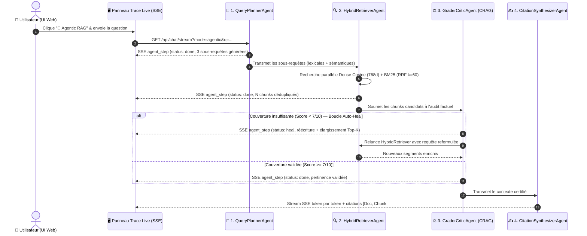

# RAG Comparison Demo

[](https://go.dev/)
[](https://cloud.google.com/vertex-ai)
[](https://ai.google.dev/)
[](LICENSE)

Application web de démonstration technique comparant la recherche lexicale classique (mots-clés) et la génération augmentée par récupération (RAG groundé) avec la famille de modèles Google Gemini 3 sur Vertex AI.

L'application s'exécute comme un binaire Go autonome compilé sans dépendance externe (`0 dependencies`, `0 CVE`). Elle est déployée sur **Google Cloud Run** ou **Google Kubernetes Engine (GKE) Autopilot** au sein de l'architecture [GCP AI Foundation Blueprint](https://github.com/cloud-gtm/gcp-ai-foundation-blueprint).

---

## Fonctionnalités

### 1. Recherche Hybride (Sémantique & Lexicale)
- **Embeddings denses** : Vectorisation via le modèle Vertex AI `text-multilingual-embedding-002` (vecteurs de 768 dimensions).
- **Similarité cosinus en Go natif** : Calcul vectoriel sans base de données vectorielle externe ni bibliothèque CGO.
- **Score combiné** : Pondération $0{,}65 \times \text{Similarité}_{\text{cos}} + 0{,}35 \times \text{Score}_{\text{lex}}$ (BM25 normalisé).
- **Repli automatique** : Si l'API d'embeddings est indisponible ou hors quota, le moteur bascule de manière transparente sur la recherche lexicale avec normalisation linguistique (repliage d'accents, élisions, stop words).

### 2. Suite de Modèles Gemini 3 & Arena Multi-Modèles
- **Modèles supportés** :
  - `gemini-3.5-flash` (défaut) : Latence ultra-faible, débit élevé et efficience multimodale.
  - `gemini-3.8-flash` : Raisonnement de code et capacités agentiques avancées.
  - `gemini-3.1-pro-preview` : Raisonnement complexe et analyse approfondie d'architectures.
  - `gemini-3.5-flash-lite` : Cas d'usage haute fréquence à contrainte de coût minimale.
- **Sélecteur dynamique** : Changement de modèle à chaud via `/api/model/switch` sans redémarrage de conteneur.
- **Modes d'affichage (5 modes interactifs)** :
  - **RAG Simple** : Réponse unifiée avec passages sources et télémétrie.
  - **Split View** : Confrontation directe entre recherche lexicale brute et synthèse RAG.
  - **Arena (2 Modèles)** : Génération simultanée côte à côte sur la même requête avec deux modèles distincts.
  - **Triple Comparatif** : Écran 3 colonnes (Modèle A, Modèle B, Recherche Classique).
  - **🤖 Agentic RAG (Swarm 4 Sous-Agents CRAG)** : Pipeline multi-agents auto-correctif (`QueryPlanner` ➔ `HybridRetriever` ➔ `GraderCritic` avec boucle *Auto-Heal* ➔ `CitationSynthesizer`) accompagné d'un tiroir **Trace Live** affichant en direct chaque étape SSE (`event: agent_step`).
- **Télémétrie en temps réel** : Mesure du temps jusqu'au premier token (TTFT en ms), durée totale, et décompte exact des tokens via l'API Vertex AI.

### 3. Évaluation GenAI à la Demande (Autorater Vertex AI)
- **Déclenchement unitaire** : Bouton d'évaluation sous chaque réponse générée.
- **Métriques calculées** :
  - **Groundedness (Ancrage)** : Mesure l'alignement factuel de la réponse avec les passages documentaires fournis (note de 1 à 5).
  - **QA Relevance (Pertinence)** : Évalue la conformité de la réponse par rapport à la question posée (note de 1 à 5).
- **Rapports d'évaluation** : Modal interactif affichant les notes, les explications textuelles produites par l'Autorater Vertex AI, et les données de contexte évaluées.
- **Repli heuristique** : En cas d'indisponibilité du service Rapid Evaluation, une analyse locale par chevauchement n-grammes assure la continuité de service.

### 4. Persistance Cloud Storage & Multi-Instances
- **Index sérialisé** : Les documents ingérés et leurs embeddings sont persistés au format JSON compressé dans `gs://{GCS_RAG_BUCKET}/index/corpus.json`.
- **Scaling horizontal** : Prise en charge de plusieurs instances Cloud Run sans divergence d'état documentaire.
- **Démarrage instantané** : Restauration du snapshot GCS au boot de l'instance en moins d'une seconde.

---

## Architecture

Consultez le schéma d'architecture complet au format GCP Draw dans [docs/architecture-gcpdraw.md](docs/architecture-gcpdraw.md).

```
                            [ Navigateur Client ]
                                     │
                   HTTPS / Identity-Aware Proxy (IAP)
                                     │
                                     ▼
                     [ Google Cloud Load Balancer ]
                                     │
                                     ▼
                     [ Cloud Run : rag-comparison ]
                     ┌────────────────────────────┐
                     │ • Serveur HTTP Go natif    │
                     │ • Moteur Recherche Hybride │
                     │ • Swarm 4-Agents CRAG      │
                     │ • Static Assets (embed.FS) │
                     └──────┬──────────────┬──────┘
                            │              │
           Vectorisation &  │              │  Stockage Corpus
           Inférence LLM    │              │  & Snapshots
                            ▼              ▼
                    [ Vertex AI ]    [ Cloud Storage ]
                    • Gemini 3.5/3.8 • gs://{BUCKET}/index/
                    • Embeddings 002
                    • Rapid Eval
```

---

## Référence de l'API REST

Toutes les routes d'API sont servies par le binaire Go sur le port configuré (`PORT`, défaut `8080`).

| Méthode | Point de terminaison | Paramètres | Description |
| :--- | :--- | :--- | :--- |
| `GET` | `/api/documents` | Aucun | Liste l'ensemble des documents indexés avec leurs métadonnées (titre, taille, passages). |
| `POST` | `/api/documents/upload` | Multipart form (`files[]`) | Téléverse et indexe de nouveaux fichiers (PDF, texte, markdown) avec calcul d'embeddings. |
| `DELETE` | `/api/documents?id={id}` | `id` (identifiant document) | Supprime un document du corpus et met à jour l'index sur Cloud Storage. |
| `DELETE` | `/api/documents?all=true` | `all=true` | Purge l'intégralité du corpus documentaire en mémoire et sur Cloud Storage. |
| `GET` | `/api/search/classic` | `q={query}` | Exécute une recherche lexicale par mots-clés et retourne les extraits bruts. |
| `GET` | `/api/chat/stream` | `q={query}`, `model={model_id}`, `mode=agentic` *(opt.)* | Établit un flux SSE (`event: agent_step`, `retrieval`, `token`, `metrics`) pour streamer la réponse RAG standard ou le pipeline 4-agents CRAG. |
| `GET` | `/api/models` | Aucun | Liste les modèles Gemini disponibles, leurs caractéristiques et le modèle actif. |
| `POST` | `/api/model/switch` | Corps JSON `{"model": "id"}` | Modifie dynamiquement le modèle Gemini utilisé par défaut. |
| `POST` | `/api/evaluate` | Corps JSON `{"query", "prediction", "context"}` | Lance une évaluation d'ancrage et de pertinence via Vertex AI Rapid Evaluation. |
| `GET` | `/healthz` | Aucun | Sonde de vivacité et de disponibilité pour Cloud Run et Kubernetes. |

---

## Variables d'Environnement

L'application lit sa configuration depuis les variables d'environnement suivantes :

| Variable | Type | Valeur par défaut | Description |
| :--- | :--- | :--- | :--- |
| `GCP_PROJECT` (ou `PROJECT_ID`) | Chaîne | Découverte via métadonnées GCP | Identifiant du projet Google Cloud hébergeant Vertex AI. |
| `GCP_REGION` (ou `REGION`) | Chaîne | `europe-west1` | Région Google Cloud utilisée pour les appels d'API régionaux. |
| `GEMINI_MODEL` | Chaîne | `gemini-3.5-flash` | Modèle Gemini par défaut au démarrage du service. |
| `GCS_RAG_BUCKET` | Chaîne | Aucune (optionnel) | Nom du bucket GCS pour la persistance de l'index documentaire (`corpus.json`). |
| `PORT` | Entier | `8080` | Port d'écoute du serveur HTTP. |

---

## Démarrage Rapide

### Prérequis
- Go 1.25 ou supérieur installé localement.
- Google Cloud SDK (`gcloud`) authentifié avec accès au projet GCP cible.
- Droits IAM requis : `roles/aiplatform.user` et `roles/storage.objectAdmin`.

### Exécution Locale

```bash
# 1. Cloner le dépôt et se placer dans le répertoire source
cd src

# 2. Configurer les variables d'environnement GCP (GCP_PROJECT ou PROJECT_ID)
export GCP_PROJECT=$(gcloud config get-value project)
export GCP_REGION="europe-west1"
export GEMINI_MODEL="gemini-3.5-flash"
export GCS_RAG_BUCKET="${GCP_PROJECT}-rag-docs"

# 3. Lancer les tests unitaires
go test -v ./...

# 4. Démarrer le serveur applicatif
go run main.go
```

L'interface web est accessible sur `http://localhost:8080`.

---

## Déploiement

Consultez le [Guide de Déploiement Complet](docs/DEPLOYMENT_GUIDE.md) pour les instructions détaillées.

### Option 1 : Google Cloud Run (Serverless)

```bash
./deploy/cloudrun/deploy.sh
```

### Option 2 : GKE Autopilot (GCP AI Foundation Blueprint)

```bash
./scripts/deploy-to-blueprint.sh --blueprint-dir=../gcp-ai-foundation-blueprint
```

---

## Sécurité & Conformité

- **Gestion des identités** : Aucun secret ni clé de compte de service statique n'est embarqué dans l'image conteneur. L'authentification repose exclusivement sur **Workload Identity** (GKE) et le compte de service d'exécution Cloud Run via le serveur de métadonnées de l'instance (`http://metadata.google.internal`).
- **Contrôle d'accès réseau** : Déploiement recommandé avec l'option `--ingress=internal-and-cloud-load-balancing`, protégé en amont par Cloud Armor et Google Cloud Identity-Aware Proxy (IAP).
- **Zéro dépendance tierce** : Le code applicatif Go n'utilise aucun framework externe (`0 dépendances directes`, `0 vulnérabilités CVE` au scan conteneur).

---

## 🤖 Architecture Agentique Dual-Layer (Runtime CRAG Swarm & M1L1 Skills)

Ce dépôt implémente une architecture agentique à **deux niveaux complémentaires** :
- 🚀 **Couche 2 (Run-Time en Production)** : Un **Swarm de 4 Sous-Agents Corrective RAG (CRAG)** embarqué dans le binaire Go (`src/main.go`), déclenché en temps réel par l'utilisateur dans l'interface web.
- 🛠️ **Couche 1 (Build-Time en Ingénierie)** : **2 Sous-Agents spécialisés et 1 Skill M1L1** (`.agents/`), déclenchés dans l'IDE/CLI lors du développement et avant chaque `git commit`.

### 🔄 Diagramme de Séquence : Comment les 4 Sous-Agents CRAG entrent en action en direct

Lorsque l'utilisateur active le bouton **`🤖 Agentic RAG`** dans l'interface (`https://rag.hoffmannw.demo.altostrat.com`) et pose une question, voici l'enchaînement exact streamé en SSE (`event: agent_step`) vers le panneau **Trace Live** :



### 📊 Matrice Récapitulative : Où et Comment chaque Agent intervient

| Agent / Skill | Couche | Où vit-il ? | Comment / Quand entre-t-il en action ? | Rôle & Valeur ajoutée |
| :--- | :--- | :--- | :--- | :--- |
| **`QueryPlannerAgent`** | **Couche 2** *(Run-Time)* | `src/main.go` (`runAgenticRAGPipeline`) | **Étape 1** dès l'envoi d'une question en mode `🤖 Agentic RAG`. | Décompose une question complexe ou multi-critères en sous-requêtes ciblées (mots-clés lexicaux + concepts sémantiques). |
| **`HybridRetrieverAgent`** | **Couche 2** *(Run-Time)* | `src/main.go` (`runAgenticRAGPipeline`) | **Étape 2** après la planification (et lors d'un *Auto-Heal*). | Exécute la recherche hybride parallèle **Dense Cosine + Sparse BM25 via Reciprocal Rank Fusion ($k=60$)** et déduplique les passages. |
| **`GraderCriticAgent`** | **Couche 2** *(Run-Time)* | `src/main.go` (`runAgenticRAGPipeline`) | **Étape 3** avant toute génération LLM. | Évalue la pertinence factuelle des passages extraits (`/10`). Déclenche automatiquement une boucle **Auto-Heal (Query Rewrite)** si le contexte est incomplet. |
| **`CitationSynthesizerAgent`** | **Couche 2** *(Run-Time)* | `src/main.go` (`runAgenticRAGPipeline`) | **Étape 4** une fois les passages validés par le `GraderCriticAgent`. | Génère la synthèse en streaming SSE avec citations vérifiées `[Doc: <Titre>, Chunk #X]` et lance l'évaluation Autorater Vertex AI. |
| **[`rag-eval-scientist`](.agents/agents/rag-eval-scientist.md)** | **Couche 1** *(Build-Time)* | `.agents/agents/rag-eval-scientist.md` | Dans **Jetski / Antigravity / Gemini CLI** lors du tuning des poids RRF/BM25 ou des prompts d'évaluation. | Audite les hyperparamètres **RRF ($k=60$)**, BM25 ($k_1=1.2, b=0.75$) et la fidélité **LLM-as-a-Judge** (`Groundedness` / `QA Relevance`). |
| **[`go-concurrency-reviewer`](.agents/agents/go-concurrency-reviewer.md)** | **Couche 1** *(Build-Time)* | `.agents/agents/go-concurrency-reviewer.md` | Dans **Jetski / Antigravity / Gemini CLI** avant de commiter du code Go (`src/main.go`). | Vérifie l'absence de deadlock `sync.RWMutex`, la fermeture propre des flux SSE (`r.Context().Done()`) et la synchro GCS asynchrone. |
| **[`rag-benchmark-and-ci`](.agents/skills/rag-benchmark-and-ci/SKILL.md)** | **Couche 1** *(Gatekeeper)* | `.agents/skills/rag-benchmark-and-ci/scripts/verify.sh` | Exécuté dans le terminal avant chaque `git commit` ou déploiement Cloud Run. | Vérifie `go vet ./...`, `go test -v -race ./...`, la règle **Zero External Dependencies** (`src/go.mod`) et la présence des 4 agents CRAG. |

---

## Licence

Ce projet est distribué sous licence Apache 2.0. Consultez le fichier [LICENSE](LICENSE) pour plus d'informations.


