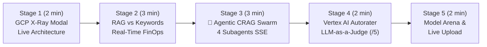

# 🎬 Step-by-Step Demo Playbook — `app-rag-comparison` (Hybrid RAG & Agentic CRAG Swarm)

> 🌐 **[Lire ce Guide de Démo en Français 🇫🇷](DEMO_PLAYBOOK.md)** | 🏠 **[Back to Main README](../README-EN.md)** | 🚀 **[Open Live Demo](https://rag.hoffmannw.demo.altostrat.com)**

This document is the **step-by-step live demonstration playbook** for showcasing the **Hybrid RAG vs 4-Subagent Agentic CRAG Swarm vs Keyword Search** comparator running on **Google Cloud Run** (`europe-west1`).

Every stage specifies:
1. **🖱️ Action to Perform** (1-Click UI button or CLI command)
2. **🤖 Which Agent / GCP Service Acts Under the Hood**
3. **👀 What to Observe on Screen & 💡 Key Customer Pitch (GCP Value)**

---

## ⏱️ Demo Flow Overview (Duration: 10–12 min)



---

## 🔹 Stage 1: Open the Live Architecture X-Ray (`🏗️ Architecture GCP (X-Ray)`)

### 1. 🖱️ Action to Perform
1. Open **[`https://rag.hoffmannw.demo.altostrat.com`](https://rag.hoffmannw.demo.altostrat.com)**.
2. Click the blue **`🏗️ Architecture GCP (X-Ray)`** button in the top-right header.

### 2. 🤖 Which GCP Services Are Highlighted Under the Hood
The modal displays the 6 managed Google Cloud building blocks traversed by every query:
1. **Cloud Armor WAF & IAP** (Zero-Trust L7 OWASP Top 10)
2. **Cloud Run v2 (Go 1.24)** (Serverless, Direct VPC Egress, real-time SSE `text/event-stream`)
3. **Agentic CRAG Swarm** (4 subagents: `QueryPlanner` ➔ `HybridRetriever` ➔ `GraderCritic` ➔ `CitationSynthesizer`)
4. **Hybrid Search (0.7 / 0.3)** (768-dim `text-embedding-004` vectors + BM25 lexical scoring)
5. **Cloud Storage (GCS UBLA)** (Automatic persistence of documents and JSONL vector index)
6. **LLM-as-a-Judge Autorater & FinOps** (On-demand Groundedness `/5` audit and `~$0.00012` per-query token cost).

### 3. 👀 What to Observe & 💡 Key Customer Pitch
- **On screen**: Every card includes a **1-Click Deep Link** directly into the Google Cloud Console (`wh-ai-blueprint-a363`).
- **💡 Key Customer Pitch**: *"This entire application runs 100% serverlessly on Cloud Run v2 in Belgium (`europe-west1`) with zero static JSON service account keys thanks to Workload Identity / ADC."*

---

## 🔹 Stage 2: Hybrid RAG vs Keyword Search & Real-Time FinOps Telemetry

### 1. 🖱️ Action to Perform
Above the bottom chat input bar, click the **1-Click Demo** pill:
> **`💰 FinOps & RAG vs Mots-Clés`**
*(Automatically switches to `RAG vs Search` split mode and submits: "Quels sont les seuils d'alerte budgétaire FinOps et comment optimiser les coûts d'inférence Gemini?")*

### 2. 🤖 What Happens Under the Hood
- **Left Column (Vertex AI Hybrid RAG)**:
  1. Computes a 768-dim query embedding via `text-embedding-004`.
  2. Combines **70% Cosine Similarity + 30% BM25 Lexical score**.
  3. Streams the grounded synthesis via **Gemini 3.5 Flash** with explicit `[Source: ...]` citations.
- **Right Column (Classic Keyword Search)**:
  - Raw keyword matching returning unorganized text snippets.

### 3. 👀 What to Observe & 💡 Key Customer Pitch
- **On screen**:
  - **Grounding Pills** show exact hybrid match percentages (`%`) with hover tooltips breaking down `Semantic vs BM25`.
  - The telemetry bar displays live metrics: `⚡ 1st token: ~380ms | Total: ~1200ms | 💰 FinOps: ~$0.00011`.
- **💡 Key Customer Pitch**: *"Where legacy keyword search forces employees to read through 10 raw documents, Google Cloud Hybrid RAG delivers a cited executive answer in under a second for a fraction of a cent."*

---

## 🔹 Stage 3: Trigger the `🤖 Agentic RAG` Swarm (4 CRAG Subagents)

### 1. 🖱️ Action to Perform
Click the amber **1-Click Demo** pill above the chat input:
> **`🤖 Multi-Hop Agentic CRAG (4 Agents)`**
*(Submits a cross-domain query comparing Cloud Armor WAF rules, Backup DR WORM retention, and FinOps budget thresholds)*

*(CLI alternative: `make demo-agentic`)*

### 2. 🤖 Which Subagents Act Under the Hood (`src/agentic_rag.go`)
The **`🤖 Agentic RAG`** view compares the **4-Subagent CRAG Swarm** (left) against **Standard Single-Shot RAG** (right):
1. **`QueryPlannerAgent` (🧠 Planner)**: Decomposes the complex prompt into 3 targeted sub-queries (`[#1] Cloud Armor WAF`, `[#2] Backup DR WORM`, `[#3] FinOps thresholds`).
2. **`HybridRetrieverAgent` (🔍 Retriever)**: Runs parallel hybrid searches across the corpus and deduplicates chunks.
3. **`GraderCriticAgent` (⚖️ CRAG Critic)**: Evaluates chunk relevance and filters out low-relevance noise before generation.
4. **`CitationSynthesizerAgent` (✍️ Synthesizer)**: Streams the consolidated multi-source answer.

### 3. 👀 What to Observe & 💡 Key Customer Pitch
- **On screen**: The **`Orchestration Multi-Agents (Swarm CRAG — 4 Sous-Agents)`** panel animates live via `agent_step` SSE events, displaying each subagent's millisecond duration and generated sub-queries.
- **💡 Key Customer Pitch**: *"When a user asks a multi-hop question spanning Security, Disaster Recovery, and FinOps, single-shot RAG often misses one of the topics. Corrective Agentic RAG on Vertex AI decomposes the query, grades its own retrieved evidence, and guarantees complete coverage."*

---

## 🔹 Stage 4: Quality Audit via `LLM-as-a-Judge` (`Vertex AI Autorater`)

### 1. 🖱️ Action to Perform
Below any generated RAG response, click the purple button:
> **`⚖️ Évaluer la réponse (Vertex AI Autorater)`**

*(CLI alternative: `make demo-evaluate`)*

### 2. 🤖 Which Service Acts Under the Hood (`POST /api/evaluate`)
The backend invokes **Vertex AI Rapid Evaluation (`Autorater`)**, acting as an independent `LLM-as-a-Judge` scoring two metrics from **1.0 to 5.0**:
- **Groundedness**: Verifies that every claim is strictly supported by the retrieved context (zero hallucination).
- **Answer Relevance**: Verifies that the response directly answers the user's question.

### 3. 👀 What to Observe & 💡 Key Customer Pitch
- **On screen**: A score card (`4.9 / 5 ★★★★★`) with an expandable reasoning audit explaining why the judge awarded each score.
- **💡 Key Customer Pitch**: *"You don't have to take the AI's word for it: Vertex AI includes a built-in automated auditor that mathematically scores factual grounding."*

---

## 🔹 Stage 5: Model Arena (`Flash vs Pro`) & Live Document Upload

### 1. 🖱️ Action to Perform
1. Click **`⚖️ Arena Modèles (Flash vs Pro)`** above the input bar to benchmark **Gemini 3.5 Flash** vs **Gemini 3.8 Flash / 3.1 Pro** side by side.
2. In the left sidebar (**Corpus Documentaire**), click **`Ajouter un document à la volée`** to upload a live PDF/DOCX/TXT file and watch it persist to Cloud Storage (`gs://...-rag-docs`).
3. In the terminal, run the M1L1 Gatekeeper check:
   ```bash
   make verify
   ```
