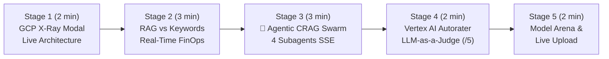

# 🎬 Step-by-Step Demo Playbook — `app-rag-comparison` (Hybrid RAG & Agentic CRAG Swarm)

> 🌐 **[Lire ce Guide de Démo en Français 🇫🇷](DEMO_PLAYBOOK.md)** | 🏠 **[Back to Main README](../README-EN.md)** | 🚀 **[Open Live Demo](https://rag.hoffmannw.demo.altostrat.com)** | 🗺️ **[Dendrite v3.3 & Draw.io Diagrams](architecture-gcpdraw.md)**


> 🎨 **Interactive Dendrite v3.3 Architecture (Bento Matrix 16:9)**: You can switch to the **`🗺️ Interactive Dendrite v3.3 Diagram`** tab directly inside the app's **`🏗️ Architecture GCP (X-Ray)`** modal, or open it full-screen in [**Dendrite Studio ↗**](https://dendrite-758054785671.cr.gclb.goog/#code=dGhlbWU6ICJnY3AtYXJjaGl0ZWN0dXJlIgpyZW5kZXJPcmRlcjogbm9kZXMtZmlyc3QKZGlyZWN0aW9uOiByaWdodApzcGFjaW5nOiAyNgoKY29uc3QgR2NwQmx1ZSA9ICIjMWE3M2U4Igpjb25zdCBHY3BHcmVlbiA9ICIjMWU4ZTNlIgpjb25zdCBEYXJrU2xhdGUgPSAiIzIwMjEyNCIKY29uc3QgU3ViVGV4dCA9ICIjNWY2MzY4Igpjb25zdCBDYXJkQm9yZGVyID0gIiNkYWRjZTAiCmNvbnN0IFN1cmZhY2VXaGl0ZSA9ICIjZmZmZmZmIgoKU3R5bGUgQFByb2R1Y3RDYXJkIHsKICB3aWR0aDogMTk2LCBoZWlnaHQ6IDYwLAogIGZpbGw6ICRTdXJmYWNlV2hpdGUsIHN0cm9rZUNvbG9yOiAkQ2FyZEJvcmRlciwgc3Ryb2tlV2lkdGg6IDEsIGJvcmRlclJhZGl1czogOCwKICBmb250Q29sb3I6ICREYXJrU2xhdGUsIHN1YkZvbnRDb2xvcjogJFN1YlRleHQsCiAgZm9udFNpemU6IDEzLCBzdWJGb250U2l6ZTogMTAuNSwgbGFiZWxXZWlnaHQ6IGJvbGQsCiAgdGV4dEFsaWduOiAibGVmdCIsIHRleHRWQWxpZ246ICJtaWRkbGUiLAogIGljb25Qb3NpdGlvbjogImxlZnQiLCBpY29uU2l6ZTogMjYsIHBhZGRpbmc6IDEwLCBzaGFkb3c6IHRydWUKfQpTdHlsZSBAWm9uZUJsdWUgICB7IGZpbGw6ICIjZThmMGZlIiwgc3Ryb2tlOiAiIzViOWJmMyIsIGJvcmRlclJhZGl1czogMTIgfQpTdHlsZSBAWm9uZUdyZWVuICB7IGZpbGw6ICIjZTZmNGVhIiwgc3Ryb2tlOiAiIzY4Yjg4ZSIsIGJvcmRlclJhZGl1czogMTIgfQpTdHlsZSBAWm9uZVBlYWNoICB7IGZpbGw6ICIjZmNlOGU2Iiwgc3Ryb2tlOiAiI2YyOGI4MiIsIGJvcmRlclJhZGl1czogMTIgfQpTdHlsZSBAWm9uZVB1cnBsZSB7IGZpbGw6ICIjZjNlOGZkIiwgc3Ryb2tlOiAiI2ExNDJmNCIsIGJvcmRlclJhZGl1czogMTIgfQoKWm9uZSBAUkFHX0NvbXBhcmlzb25fQXJjaGl0ZWN0dXJlIHsKICB0aXRsZTogIkdDUCBBSSBGb3VuZGF0aW9uIOKAlCBIeWJyaWQgUkFHICYgNC1BZ2VudCBDUkFHIFN3YXJtIENvbXBhcmF0b3IiCiAgc3VidGl0bGU6ICJDbG91ZCBSdW4gdjIgKEdvIDEuMjQgWmVyby1DVkUpIOKAoiBSZWFsLVRpbWUgU1NFIFN0cmVhbWluZyDigKIgVmVydGV4IEFJIEF1dG9yYXRlciAoZXVyb3BlLXdlc3QxKSIKICBpY29uOiAiR29vZ2xlQ2xvdWQiLCBpY29uU2l6ZTogMjQKICBsYXlvdXQ6IG1hdHJpeCwgZ2FwOiAyNCwgcGFkZGluZzogMjQsIGFsaWduOiAic3RyZXRjaCIKICBmaWxsOiAiI2Y4ZmFmZCIsIHN0cm9rZTogIiNkYWRjZTAiLCBjb3JuZXJSYWRpdXM6IDE0CiAgYXJlYXM6IFsKICAgICJ1cHN0cmVhbSAgYXJjaEEgIGFyY2hCIiwKICAgICJ1cHN0cmVhbSAgc3RvcmUgIHN0b3JlIgogIF0KCiAgWm9uZSBAVXBzdHJlYW1fRWRnZSB7CiAgICB0aXRsZTogIjEuIFplcm8tVHJ1c3QgSW5ncmVzcyIKICAgIHN1YnRpdGxlOiAiQ2xvdWQgUnVuIHYyIFNTRSIKICAgIHN0eWxlOiBAWm9uZVBlYWNoLCBhcmVhOiAidXBzdHJlYW0iCiAgICBsYXlvdXQ6IGNvbHVtbiwgZ2FwOiAyMCwgcGFkZGluZzogMTgsIGFsaWduOiAiY2VudGVyIiwgaWNvbjogIkNsb3VkQXJtb3IiLCBpY29uU2l6ZTogMjAKICAgIFthcm1vcl9pYXA6ICJDbG91ZCBBcm1vciAmIElBUCIgfCAiV0FGIEw3ICsgWmVyby1UcnVzdCJdIHsgc3R5bGU6IEBQcm9kdWN0Q2FyZCwgaWNvbjogIkNsb3VkQXJtb3IiIH0KICAgIFtjbG91ZF9ydW5fZ286ICJDbG91ZCBSdW4gdjIgKEdvKSIgfCAiU1NFIFJvdXRlciAmIFgtUmF5IFVJIl0geyBzdHlsZTogQFByb2R1Y3RDYXJkLCBpY29uOiAiR2NwQ2xvdWRSdW4iIH0KICAgIFtkb2NfaW5nZXN0b3I6ICJEb2N1bWVudCBJbmdlc3RvciIgfCAiUERGIENNYXAgLyBET0NYIC8gVFhUIl0geyBzdHlsZTogQFByb2R1Y3RDYXJkLCBpY29uOiAiR2NwU3RvcmFnZUJ1Y2tldCIgfQogIH0KCiAgWm9uZSBAUGF0aF9BX0FnZW50aWNfQ1JBRyB7CiAgICB0aXRsZTogIjJBLiBNb2RlIEFnZW50aWMgUkFHICg0LVN1YmFnZW50IENSQUcgU3dhcm0pIgogICAgc3VidGl0bGU6ICJNdWx0aS1Ib3AgRGVjb21wb3NpdGlvbiAmIFNlbGYtQ29ycmVjdGlvbiIKICAgIHN0eWxlOiBAWm9uZVB1cnBsZSwgYXJlYTogImFyY2hBIgogICAgbGF5b3V0OiByb3csIGdhcDogMjIsIHBhZGRpbmc6IDE4LCBhbGlnbjogInN0cmV0Y2giLCBpY29uOiAiR29vZ2xlQWdlbnRzIiwgaWNvblNpemU6IDIwCgogICAgWm9uZSBAQ1JBR19QbGFuX1JldHJpZXZlIHsKICAgICAgdGl0bGU6ICJQbGFuICYgTXVsdGktSG9wIFJldHJpZXZlIiwgbGF5b3V0OiBjb2x1bW4sIGdhcDogMTYsIHBhZGRpbmc6IDE0LCBhbGlnbjogImNlbnRlciIsCiAgICAgIGZpbGw6ICIjZmZmZmZmIiwgc3Ryb2tlOiAiI2ExNDJmNCIsIGNvcm5lclJhZGl1czogMTAsIGljb246ICJTcGFya2xlcyIsIGljb25TaXplOiAxOAogICAgICBbYWdlbnRfcGxhbm5lcjogIjEuIFF1ZXJ5UGxhbm5lckFnZW50IiB8ICJEZWNvbXBvc2VzIFN1Yi1RdWVyaWVzIl0geyBzdHlsZTogQFByb2R1Y3RDYXJkLCBpY29uOiAiR29vZ2xlQWdlbnRzIiB9CiAgICAgIFthZ2VudF9yZXRyaWV2ZXI6ICIyLiBIeWJyaWRSZXRyaWV2ZXIiIHwgIjAuNyBDb3NpbmUgKyAwLjMgQk0yNSJdIHsgc3R5bGU6IEBQcm9kdWN0Q2FyZCwgaWNvbjogIlNlYXJjaCIgfQogICAgfQoKICAgIFpvbmUgQENSQUdfR3JhZGVfU3ludGhlc2l6ZSB7CiAgICAgIHRpdGxlOiAiQ1JBRyBDcml0aWMgJiBTeW50aGVzaXMiLCBsYXlvdXQ6IGNvbHVtbiwgZ2FwOiAxNiwgcGFkZGluZzogMTQsIGFsaWduOiAiY2VudGVyIiwKICAgICAgZmlsbDogIiNmZmZmZmYiLCBzdHJva2U6ICIjYTE0MmY0IiwgY29ybmVyUmFkaXVzOiAxMCwgaWNvbjogIlZlcnRleEFJIiwgaWNvblNpemU6IDE4CiAgICAgIFthZ2VudF9ncmFkZXI6ICIzLiBHcmFkZXJDcml0aWNBZ2VudCIgfCAiRmlsdGVycyBOb2lzZSBDaHVua3MiXSB7IHN0eWxlOiBAUHJvZHVjdENhcmQsIGljb246ICJTaGllbGRDaGVjayIgfQogICAgICBbYWdlbnRfc3ludGg6ICI0LiBDaXRhdGlvblN5bnRoZXNpemVyIiB8ICJHcm91bmRlZCBTU0UgU3RyZWFtIl0geyBzdHlsZTogQFByb2R1Y3RDYXJkLCBpY29uOiAiR2VtaW5pIiB9CiAgICB9CiAgfQoKICBab25lIEBQYXRoX0JfQXJlbmFfQW5kX0V2YWwgewogICAgdGl0bGU6ICIyQi4gU3RhbmRhcmQgUkFHLCBNb2RlbCBBcmVuYSAmIEF1dG9yYXRlciBKdWRnZSIKICAgIHN1YnRpdGxlOiAiRmxhc2ggdnMuIFBybyBCZW5jaG1hcmsgJiBMTE0tYXMtYS1KdWRnZSAoLzUpIgogICAgc3R5bGU6IEBab25lQmx1ZSwgYXJlYTogImFyY2hCIgogICAgbGF5b3V0OiByb3csIGdhcDogMjIsIHBhZGRpbmc6IDE4LCBhbGlnbjogInN0cmV0Y2giLCBpY29uOiAiVmVydGV4QUkiLCBpY29uU2l6ZTogMjAKCiAgICBab25lIEBNdWx0aU1vZGVsX0FyZW5hIHsKICAgICAgdGl0bGU6ICJNdWx0aS1Nb2RlbCBBcmVuYSIsIGxheW91dDogY29sdW1uLCBnYXA6IDE2LCBwYWRkaW5nOiAxNCwgYWxpZ246ICJjZW50ZXIiLAogICAgICBmaWxsOiAiI2ZmZmZmZiIsIHN0cm9rZTogIiM1YjliZjMiLCBjb3JuZXJSYWRpdXM6IDEwLCBpY29uOiAiR2VtaW5pIiwgaWNvblNpemU6IDE4CiAgICAgIFtnZW1pbmlfZmxhc2g6ICJHZW1pbmkgMy41IC8gMy44IEZsYXNoIiB8ICJTdWItNDAwbXMgVFRGVCJdIHsgc3R5bGU6IEBQcm9kdWN0Q2FyZCwgaWNvbjogIkdlbWluaSIgfQogICAgICBbZ2VtaW5pX3BybzogIkdlbWluaSAzLjEgUHJvIiB8ICJEZWVwIEZyb250aWVyIFJlYXNvbmluZyJdIHsgc3R5bGU6IEBQcm9kdWN0Q2FyZCwgaWNvbjogIlZlcnRleEFJIiB9CiAgICB9CgogICAgWm9uZSBAQXV0b3JhdGVyX0FuZF9GaW5vcHMgewogICAgICB0aXRsZTogIlF1YWxpdHkgJiBGaW5PcHMgQXVkaXQiLCBsYXlvdXQ6IGNvbHVtbiwgZ2FwOiAxNiwgcGFkZGluZzogMTQsIGFsaWduOiAiY2VudGVyIiwKICAgICAgZmlsbDogIiNmZmZmZmYiLCBzdHJva2U6ICIjNWI5YmYzIiwgY29ybmVyUmFkaXVzOiAxMCwgaWNvbjogIkFjdGl2aXR5IiwgaWNvblNpemU6IDE4CiAgICAgIFt2ZXJ0ZXhfYXV0b3JhdGVyOiAiVmVydGV4IEFJIEF1dG9yYXRlciIgfCAiR3JvdW5kZWRuZXNzICYgUmVsZXZhbmNlIC81Il0geyBzdHlsZTogQFByb2R1Y3RDYXJkLCBpY29uOiAiU2VjdXJpdHlDb21tYW5kQ2VudGVyIiB9CiAgICAgIFtmaW5vcHNfYmFkZ2U6ICJSZWFsLVRpbWUgRmluT3BzIiB8ICJUb2tlbiBDb3N0ICh+JDAuMDAwMTEpIl0geyBzdHlsZTogQFByb2R1Y3RDYXJkLCBpY29uOiAiQ2xvdWRCaWxsaW5nIiB9CiAgICB9CiAgfQoKICBab25lIEBTaGFyZWRfRGF0YV9Gb3VuZGF0aW9uIHsKICAgIHRpdGxlOiAiMy4gU2hhcmVkIEh5YnJpZCBWZWN0b3IgSW5kZXggJiBDbG91ZCBTdG9yYWdlIFBlcnNpc3RlbmNlIChEaXJlY3QgVlBDIEVncmVzcykiCiAgICBzdWJ0aXRsZTogIkluLU1lbW9yeSA3NjgtZGltIENvc2luZSArIEJNMjUgSW5kZXggQmFja2VkIGJ5IENsb3VkIFN0b3JhZ2UgVUJMQSIKICAgIHN0eWxlOiBAWm9uZUdyZWVuLCBhcmVhOiAic3RvcmUiCiAgICBsYXlvdXQ6IHJvdywgZ2FwOiAyMCwgcGFkZGluZzogMTgsIGFsaWduOiAiY2VudGVyIiwgaWNvbjogIkdjcERhdGFiYXNlIiwgaWNvblNpemU6IDIwCiAgICBbZ2NzX2NvcnB1c19idWNrZXQ6ICJDbG91ZCBTdG9yYWdlIFVCTEEiIHwgIkNvcnB1cyAmIEpTT05MIEluZGV4Il0geyBzdHlsZTogQFByb2R1Y3RDYXJkLCBpY29uOiAiR2NwU3RvcmFnZUJ1Y2tldCIgfQogICAgW3ZlcnRleF9lbWJlZGRpbmdzOiAiVmVydGV4IEVtYmVkZGluZ3MiIHwgInRleHQtZW1iZWRkaW5nLTAwNCAoNzY4ZCkiXSB7IHN0eWxlOiBAUHJvZHVjdENhcmQsIGljb246ICJBSVBsYXRmb3JtIiB9CiAgICBbaHlicmlkX2VuZ2luZTogIkdvIEh5YnJpZCBFbmdpbmUiIHwgIkNvc2luZSAoMC43KSArIEJNMjUgKDAuMykiXSB7IHN0eWxlOiBAUHJvZHVjdENhcmQsIGljb246ICJDcHUiIH0KICAgIFtjbG91ZF9sb2dnaW5nX2V2YWw6ICJDbG91ZCBMb2dnaW5nICYgVHJhY2UiIHwgIlNTRSAmIEV2YWwgVGVsZW1ldHJ5Il0geyBzdHlsZTogQFByb2R1Y3RDYXJkLCBpY29uOiAiQ2xvdWRMb2dnaW5nIiB9CiAgfQp9CgpbYXJtb3JfaWFwXSAtPiBbY2xvdWRfcnVuX2dvXSB7IHNvdXJjZUFuY2hvcjogImJvdHRvbSIsIHRhcmdldEFuY2hvcjogInRvcCIsIGNvbG9yOiAkR2NwQmx1ZSwgc3Ryb2tlV2lkdGg6IDIsIGN1cnZlOiAic3RlcCIsIHNlcXVlbmNlQmFkZ2U6ICIxIiwgYmFkZ2VGaWxsOiAkR2NwQmx1ZSwgYmFkZ2VGb250Q29sb3I6ICRTdXJmYWNlV2hpdGUgfQpbY2xvdWRfcnVuX2dvXSAtPiBbZG9jX2luZ2VzdG9yXSB7IHNvdXJjZUFuY2hvcjogImJvdHRvbSIsIHRhcmdldEFuY2hvcjogInRvcCIsIGNvbG9yOiAkR2NwQmx1ZSwgc3Ryb2tlV2lkdGg6IDIsIGN1cnZlOiAic3RlcCIgfQpbY2xvdWRfcnVuX2dvXSAtPiBbYWdlbnRfcGxhbm5lcl0geyBsYWJlbDogIkFnZW50aWMgU1NFIiwgc291cmNlQW5jaG9yOiAicmlnaHQiLCB0YXJnZXRBbmNob3I6ICJsZWZ0IiwgY29sb3I6ICRHY3BCbHVlLCBzdHJva2VXaWR0aDogMiwgY3VydmU6ICJzdGVwIiwgc2VxdWVuY2VCYWRnZTogIjIiLCBiYWRnZUZpbGw6ICRHY3BCbHVlLCBiYWRnZUZvbnRDb2xvcjogJFN1cmZhY2VXaGl0ZSB9ClthZ2VudF9wbGFubmVyXSAtPiBbYWdlbnRfcmV0cmlldmVyXSB7IGxhYmVsOiAiU3ViLVF1ZXJpZXMiLCBzb3VyY2VBbmNob3I6ICJib3R0b20iLCB0YXJnZXRBbmNob3I6ICJ0b3AiLCBjb2xvcjogJEdjcEJsdWUsIHN0cm9rZVdpZHRoOiAyLCBjdXJ2ZTogInN0ZXAiIH0KW2FnZW50X3JldHJpZXZlcl0gLT4gW2FnZW50X2dyYWRlcl0geyBsYWJlbDogIlRvcC1LIENodW5rcyIsIHNvdXJjZUFuY2hvcjogInJpZ2h0IiwgdGFyZ2V0QW5jaG9yOiAibGVmdCIsIGNvbG9yOiAkR2NwQmx1ZSwgc3Ryb2tlV2lkdGg6IDIsIGN1cnZlOiAic3RlcCIgfQpbYWdlbnRfZ3JhZGVyXSAtPiBbYWdlbnRfc3ludGhdIHsgbGFiZWw6ICJWZXJpZmllZCIsIHNvdXJjZUFuY2hvcjogImJvdHRvbSIsIHRhcmdldEFuY2hvcjogInRvcCIsIGNvbG9yOiAkR2NwQmx1ZSwgc3Ryb2tlV2lkdGg6IDIsIGN1cnZlOiAic3RlcCIgfQoKW2FnZW50X3N5bnRoXSAtPiBbZ2VtaW5pX2ZsYXNoXSB7IGxhYmVsOiAiQ29tcGFyZSIsIHNvdXJjZUFuY2hvcjogInJpZ2h0IiwgdGFyZ2V0QW5jaG9yOiAibGVmdCIsIGNvbG9yOiAkR2NwQmx1ZSwgc3Ryb2tlV2lkdGg6IDEuOCwgZGFzaGVkOiB0cnVlLCBjdXJ2ZTogInN0ZXAiIH0KW2dlbWluaV9mbGFzaF0gLT4gW2dlbWluaV9wcm9dIHsgbGFiZWw6ICJBcmVuYSIsIHNvdXJjZUFuY2hvcjogImJvdHRvbSIsIHRhcmdldEFuY2hvcjogInRvcCIsIGNvbG9yOiAkR2NwQmx1ZSwgc3Ryb2tlV2lkdGg6IDEuOCwgY3VydmU6ICJzdGVwIiB9CltnZW1pbmlfZmxhc2hdIC0+IFt2ZXJ0ZXhfYXV0b3JhdGVyXSB7IGxhYmVsOiAiSnVkZ2UgLzUiLCBzb3VyY2VBbmNob3I6ICJyaWdodCIsIHRhcmdldEFuY2hvcjogImxlZnQiLCBjb2xvcjogJEdjcEdyZWVuLCBzdHJva2VXaWR0aDogMiwgY3VydmU6ICJzdGVwIiwgc2VxdWVuY2VCYWRnZTogIjMiLCBiYWRnZUZpbGw6ICRHY3BHcmVlbiwgYmFkZ2VGb250Q29sb3I6ICRTdXJmYWNlV2hpdGUgfQpbdmVydGV4X2F1dG9yYXRlcl0gLT4gW2Zpbm9wc19iYWRnZV0geyBsYWJlbDogIlRva2VuIENvc3QiLCBzb3VyY2VBbmNob3I6ICJib3R0b20iLCB0YXJnZXRBbmNob3I6ICJ0b3AiLCBjb2xvcjogJEdjcEdyZWVuLCBzdHJva2VXaWR0aDogMS44LCBjdXJ2ZTogInN0ZXAiIH0KCltkb2NfaW5nZXN0b3JdIC0+IFtnY3NfY29ycHVzX2J1Y2tldF0geyBsYWJlbDogIlBlcnNpc3QgSlNPTkwiLCBzb3VyY2VBbmNob3I6ICJib3R0b20iLCB0YXJnZXRBbmNob3I6ICJsZWZ0IiwgY29sb3I6ICRHY3BCbHVlLCBzdHJva2VXaWR0aDogMiwgY3VydmU6ICJzdGVwIiB9ClthZ2VudF9yZXRyaWV2ZXJdIC0+IFt2ZXJ0ZXhfZW1iZWRkaW5nc10geyBsYWJlbDogIjc2OGQgVmVjdG9yIiwgc291cmNlQW5jaG9yOiAiYm90dG9tIiwgdGFyZ2V0QW5jaG9yOiAidG9wIiwgY29sb3I6ICRHY3BCbHVlLCBzdHJva2VXaWR0aDogMiwgY3VydmU6ICJzdGVwIiB9ClthZ2VudF9ncmFkZXJdIC0+IFtoeWJyaWRfZW5naW5lXSB7IGxhYmVsOiAiQk0yNSArIENvcyIsIHNvdXJjZUFuY2hvcjogImJvdHRvbSIsIHRhcmdldEFuY2hvcjogInRvcCIsIGNvbG9yOiAkR2NwQmx1ZSwgc3Ryb2tlV2lkdGg6IDIsIGN1cnZlOiAic3RlcCIgfQpbZmlub3BzX2JhZGdlXSAtPiBbY2xvdWRfbG9nZ2luZ19ldmFsXSB7IGxhYmVsOiAiQXVkaXQgTG9ncyIsIHNvdXJjZUFuY2hvcjogImJvdHRvbSIsIHRhcmdldEFuY2hvcjogInRvcCIsIGNvbG9yOiAkR2NwR3JlZW4sIHN0cm9rZVdpZHRoOiAxLjgsIGRhc2hlZDogdHJ1ZSwgY3VydmU6ICJzdGVwIiB9Cg==) ([`.dendrite`](diagrams/rag_comparison_crag_v3.dendrite) / [`.drawio`](diagrams/rag_comparison_crag_v3.drawio)).
This document is the **step-by-step live demonstration playbook** for showcasing the **Hybrid RAG vs 4-Subagent Agentic CRAG Swarm vs Keyword Search** comparator running on **Google Cloud Run** (`europe-west1`).

Every stage specifies:
1. **🖱️ Action to Perform** (1-Click UI button or CLI command)
2. **🤖 Which Agent / GCP Service Acts Under the Hood**
3. **👀 What to Observe on Screen & 💡 Key Customer Pitch (GCP Value)**

---

[](diagrams/rag_comparison_crag_v3.png)

## ⏱️ Demo Flow Overview (Duration: 10–12 min)



---

## 🔹 Stage 1: Open the Live Architecture X-Ray (`🏗️ Architecture GCP (X-Ray)`)

### 1. 🖱️ Action to Perform
1. Open **[`https://rag.hoffmannw.demo.altostrat.com`](https://rag.hoffmannw.demo.altostrat.com)**.
2. Click the blue **`🏗️ Architecture GCP (X-Ray)`** button in the top-right header.

### 2. 🤖 Which GCP Services Are Highlighted Under the Hood
The modal displays the 6 managed Google Cloud building blocks traversed by every query:
1. **Cloud Armor WAF & IAP** (Zero-Trust L7 OWASP Top 10)
2. **Cloud Run v2 (Go 1.24)** (Serverless, Direct VPC Egress, real-time SSE `text/event-stream`)
3. **Agentic CRAG Swarm** (4 subagents: `QueryPlanner` ➔ `HybridRetriever` ➔ `GraderCritic` ➔ `CitationSynthesizer`)
4. **Hybrid Search (0.7 / 0.3)** (768-dim `text-embedding-004` vectors + BM25 lexical scoring)
5. **Cloud Storage (GCS UBLA)** (Automatic persistence of documents and JSONL vector index)
6. **LLM-as-a-Judge Autorater & FinOps** (On-demand Groundedness `/5` audit and `~$0.00012` per-query token cost).

### 3. 👀 What to Observe & 💡 Key Customer Pitch
- **On screen**: Every card includes a **1-Click Deep Link** directly into the Google Cloud Console (`wh-ai-blueprint-a363`).
- **💡 Key Customer Pitch**: *"This entire application runs 100% serverlessly on Cloud Run v2 in Belgium (`europe-west1`) with zero static JSON service account keys thanks to Workload Identity / ADC."*

---

## 🔹 Stage 2: Hybrid RAG vs Keyword Search & Real-Time FinOps Telemetry

### 1. 🖱️ Action to Perform
Above the bottom chat input bar, click the **1-Click Demo** pill:
> **`💰 FinOps & RAG vs Mots-Clés`**
*(Automatically switches to `RAG vs Search` split mode and submits: "Quels sont les seuils d'alerte budgétaire FinOps et comment optimiser les coûts d'inférence Gemini?")*

### 2. 🤖 What Happens Under the Hood
- **Left Column (Vertex AI Hybrid RAG)**:
  1. Computes a 768-dim query embedding via `text-embedding-004`.
  2. Combines **70% Cosine Similarity + 30% BM25 Lexical score**.
  3. Streams the grounded synthesis via **Gemini 3.5 Flash** with explicit `[Source: ...]` citations.
- **Right Column (Classic Keyword Search)**:
  - Raw keyword matching returning unorganized text snippets.

### 3. 👀 What to Observe & 💡 Key Customer Pitch
- **On screen**:
  - **Grounding Pills** show exact hybrid match percentages (`%`) with hover tooltips breaking down `Semantic vs BM25`.
  - The telemetry bar displays live metrics: `⚡ 1st token: ~380ms | Total: ~1200ms | 💰 FinOps: ~$0.00011`.
- **💡 Key Customer Pitch**: *"Where legacy keyword search forces employees to read through 10 raw documents, Google Cloud Hybrid RAG delivers a cited executive answer in under a second for a fraction of a cent."*

---

## 🔹 Stage 3: Trigger the `🤖 Agentic RAG` Swarm (4 CRAG Subagents)

### 1. 🖱️ Action to Perform
Click the amber **1-Click Demo** pill above the chat input:
> **`🤖 Multi-Hop Agentic CRAG (4 Agents)`**
*(Submits a cross-domain query comparing Cloud Armor WAF rules, Backup DR WORM retention, and FinOps budget thresholds)*

*(CLI alternative: `make demo-agentic`)*

### 2. 🤖 Which Subagents Act Under the Hood (`src/agentic_rag.go`)
The **`🤖 Agentic RAG`** view compares the **4-Subagent CRAG Swarm** (left) against **Standard Single-Shot RAG** (right):
1. **`QueryPlannerAgent` (🧠 Planner)**: Decomposes the complex prompt into 3 targeted sub-queries (`[#1] Cloud Armor WAF`, `[#2] Backup DR WORM`, `[#3] FinOps thresholds`).
2. **`HybridRetrieverAgent` (🔍 Retriever)**: Runs parallel hybrid searches across the corpus and deduplicates chunks.
3. **`GraderCriticAgent` (⚖️ CRAG Critic)**: Evaluates chunk relevance and filters out low-relevance noise before generation.
4. **`CitationSynthesizerAgent` (✍️ Synthesizer)**: Streams the consolidated multi-source answer.

### 3. 👀 What to Observe & 💡 Key Customer Pitch
- **On screen**: The **`Orchestration Multi-Agents (Swarm CRAG — 4 Sous-Agents)`** panel animates live via `agent_step` SSE events, displaying each subagent's millisecond duration and generated sub-queries.
- **💡 Key Customer Pitch**: *"When a user asks a multi-hop question spanning Security, Disaster Recovery, and FinOps, single-shot RAG often misses one of the topics. Corrective Agentic RAG on Vertex AI decomposes the query, grades its own retrieved evidence, and guarantees complete coverage."*

---

## 🔹 Stage 4: Quality Audit via `LLM-as-a-Judge` (`Vertex AI Autorater`)

### 1. 🖱️ Action to Perform
Below any generated RAG response, click the purple button:
> **`⚖️ Évaluer la réponse (Vertex AI Autorater)`**

*(CLI alternative: `make demo-evaluate`)*

### 2. 🤖 Which Service Acts Under the Hood (`POST /api/evaluate`)
The backend invokes **Vertex AI Rapid Evaluation (`Autorater`)**, acting as an independent `LLM-as-a-Judge` scoring two metrics from **1.0 to 5.0**:
- **Groundedness**: Verifies that every claim is strictly supported by the retrieved context (zero hallucination).
- **Answer Relevance**: Verifies that the response directly answers the user's question.

### 3. 👀 What to Observe & 💡 Key Customer Pitch
- **On screen**: A score card (`4.9 / 5 ★★★★★`) with an expandable reasoning audit explaining why the judge awarded each score.
- **💡 Key Customer Pitch**: *"You don't have to take the AI's word for it: Vertex AI includes a built-in automated auditor that mathematically scores factual grounding."*

---

## 🔹 Stage 5: Model Arena (`Flash vs Pro`) & Live Document Upload

### 1. 🖱️ Action to Perform
1. Click **`⚖️ Arena Modèles (Flash vs Pro)`** above the input bar to benchmark **Gemini 3.5 Flash** vs **Gemini 3.8 Flash / 3.1 Pro** side by side.
2. In the left sidebar (**Corpus Documentaire**), click **`Ajouter un document à la volée`** to upload a live PDF/DOCX/TXT file and watch it persist to Cloud Storage (`gs://...-rag-docs`).
3. In the terminal, run the M1L1 Gatekeeper check:
   ```bash
   make verify
   ```
