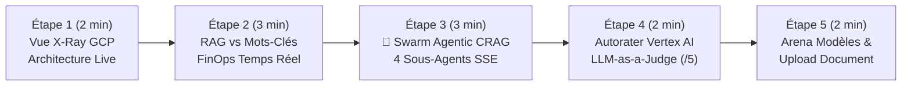

# 🎬 Guide de Démonstration Pas-à-Pas — `app-rag-comparison` (RAG Hybride & Swarm Agentic CRAG)

> 🌐 **[Read this Demo Playbook in English 🇬🇧](DEMO_PLAYBOOK-EN.md)** | 🏠 **[Retour au README Principal](../README.md)** | 🚀 **[Ouvrir la Démo Live](https://rag.hoffmannw.demo.altostrat.com)**

Ce document est le **conducteur de démonstration pas-à-pas** pour présenter le comparateur **RAG Hybride vs Swarm Agentic CRAG (4 sous-agents) vs Recherche Lexicale** hébergé sur **Google Cloud Run** (`europe-west1`).

Chaque étape détaille :
1. **🖱️ Action à réaliser** (bouton 1-Click dans l'UI ou commande CLI)
2. **🤖 Quel Agent / Service GCP entre en action** (sous le capot)
3. **👀 Ce qu'il faut observer à l'écran & 💡 Message clé client (Valeur GCP)**

---

## ⏱️ Vue d'Ensemble du Scénario (Durée : 10 à 12 min)



---

## 🔹 Étape 1 : Ouvrir la Radiographie Temps Réel (`🏗️ Architecture GCP (X-Ray)`)

### 1. 🖱️ Action à réaliser
1. Ouvrir **[`https://rag.hoffmannw.demo.altostrat.com`](https://rag.hoffmannw.demo.altostrat.com)**.
2. Cliquer en haut à droite sur le bouton bleu **`🏗️ Architecture GCP (X-Ray)`**.

### 2. 🤖 Quels Services GCP sont présentés sous le capot
La modale affiche les 6 briques traversées par chaque requête :
1. **Cloud Armor WAF & IAP** (Zero-Trust L7 OWASP Top 10)
2. **Cloud Run v2 (Go 1.24)** (Serverless, Direct VPC Egress, streaming SSE `text/event-stream`)
3. **Swarm Agentic CRAG** (4 sous-agents : `QueryPlanner` ➔ `HybridRetriever` ➔ `GraderCritic` ➔ `CitationSynthesizer`)
4. **Recherche Hybride (0.7 / 0.3)** (Vecteurs 768-dim `text-embedding-004` + score lexical BM25)
5. **Cloud Storage (GCS UBLA)** (Persistance automatique du corpus et de l'index JSONL)
6. **Autorater LLM-as-a-Judge & FinOps** (Audit d'ancrage `/5` et coût par requête `~$0.00012`).

### 3. 👀 Ce qu'il faut observer & 💡 Message clé client
- **À l'écran** : Chaque brique comporte un **Deep-Link 1-Click** qui ouvre directement la ressource correspondante dans la Console Google Cloud (`wh-ai-blueprint-a363`).
- **💡 Message clé client** : *« Tout ce démonstrateur tourne en Serverless pur sur Cloud Run v2 en Belgique (`europe-west1`), sans aucune clé JSON statique grâce à Workload Identity / ADC. »*

---

## 🔹 Étape 2 : RAG Hybride vs Recherche par Mots-Clés & Coût FinOps Temps Réel

### 1. 🖱️ Action à réaliser
Au-dessus de la barre de saisie en bas de l'écran, cliquer sur la pilule **Démo 1-Click** :
> **`💰 FinOps & RAG vs Mots-Clés`**
*(Question injectée automatiquement : « Quels sont les seuils d'alerte budgétaire FinOps et comment optimiser les coûts d'inférence Gemini ? » en mode `RAG vs Recherche`)*

### 2. 🤖 Ce qui se passe sous le capot
- **Colonne de gauche (RAG Hybride Vertex AI)** :
  1. Calcul de l'embedding 768-dim de la question via `text-embedding-004`.
  2. Fusion **70% Similarité Cosinus + 30% BM25 Lexical**.
  3. Génération en streaming SSE via **Gemini 3.5 Flash** avec citations explicites `[Source: ...]`.
- **Colonne de droite (Recherche Classique)** :
  - Simple correspondance de mots-clés retournant des extraits bruts non synthétisés.

### 3. 👀 Ce qu'il faut observer & 💡 Message clé client
- **À l'écran** :
  - Les **pilules de Grounding** affichent le score hybride exact (`%`) et le détail au survol (`Sémantique vs BM25`).
  - La barre de télémétrie affiche en direct : `⚡ 1er token: ~380ms | Total: ~1200ms | 💰 FinOps: ~$0.00011`.
- **💡 Message clé client** : *« Là où la recherche classique oblige l'collaborateur à lire 10 documents PDF, le RAG Hybride Google Cloud synthétise la réponse exacte en moins d'une seconde pour un coût inférieur à un centième de centime d'euro. »*

---

## 🔹 Étape 3 : Déclencher le Swarm `🤖 Agentic RAG` (4 Sous-Agents CRAG)

### 1. 🖱️ Action à réaliser
Cliquer sur la pilule **Démo 1-Click** ambrée au-dessus de la zone de saisie :
> **`🤖 Multi-Hop Agentic CRAG (4 Agents)`**
*(Question multi-domaine injectée : « Compare les règles de sécurité Cloud Armor WAF, la politique de rétention WORM Backup DR et les seuils d'alerte FinOps »)*

*(Alternative en CLI : `make demo-agentic`)*

### 2. 🤖 Quels Sous-Agents entrent en action sous le capot (`src/agentic_rag.go`)
Le mode **`🤖 Agentic RAG`** compare côte à côte le **Swarm CRAG (4 sous-agents)** (à gauche) et le **RAG Standard Single-Shot** (à droite) :
1. **`QueryPlannerAgent` (🧠 Planificateur)** : Décompose la question complexe en 3 sous-requêtes atomiques ciblées (`[#1] Cloud Armor WAF`, `[#2] Backup DR WORM`, `[#3] Budget FinOps`).
2. **`HybridRetrieverAgent` (🔍 Chasseur Documentaire)** : Exécute la recherche hybride multi-passe en parallèle et déduplique les passages.
3. **`GraderCriticAgent` (⚖️ Critique CRAG)** : Évalue la pertinence de chaque extrait trouvé et filtre le bruit documentaire avant d'appeler le LLM.
4. **`CitationSynthesizerAgent` (✍️ Rédacteur)** : Produit la synthèse finale consolidée avec citations croisées.

### 3. 👀 Ce qu'il faut observer & 💡 Message clé client
- **À l'écran** : Le panneau **`Orchestration Multi-Agents (Swarm CRAG — 4 Sous-Agents)`** s'anime étape par étape en temps réel (`agent_step` SSE) avec la latence en millisecondes de chaque sous-agent et les sous-requêtes générées.
- **💡 Message clé client** : *« Sur une question transversale touchant à 3 domaines (Sécurité, Sauvegarde WORM et FinOps), un RAG classique à 1 seule passe oublie souvent un aspect. Le pattern Agentic CRAG sur Vertex AI décompose le problème, vérifie ses propres sources et garantit une couverture exhaustive. »*

---

## 🔹 Étape 4 : Audit Qualité par `LLM-as-a-Judge` (`Vertex AI Autorater`)

### 1. 🖱️ Action à réaliser
Sous la réponse générée par le modèle, cliquer sur le bouton violet :
> **`⚖️ Évaluer la réponse (Vertex AI Autorater)`**

*(Alternative en CLI : `make demo-evaluate`)*

### 2. 🤖 Quel Agent / Service entre en action sous le capot (`POST /api/evaluate`)
Le backend appelle **Vertex AI Rapid Evaluation (`Autorater`)** qui agit comme un juge indépendant (`LLM-as-a-Judge`) sur deux métriques officielles notées de **1.0 à 5.0** :
- **Ancrage (`Groundedness`)** : Vérifie que 100% des affirmations proviennent strictement des passages documentaires extraits (zéro hallucination).
- **Pertinence (`Answer Relevance`)** : Vérifie que la réponse traite intégralement la question posée.

### 3. 👀 Ce qu'il faut observer & 💡 Message clé client
- **À l'écran** : Apparition de la carte de score global (ex: `4.9 / 5 ★★★★★`) avec un accordéon **`Consulter l'audit et le raisonnement de l'Autorater`** détaillant la justification chaîne-de-pensée du juge.
- **💡 Message clé client** : *« Vous n'avez plus besoin de croire l'IA sur parole : Vertex AI intègre un auditeur automatique qui mesure mathématiquement le taux d'ancrage et bloque toute hallucination. »*

---

## 🔹 Étape 5 : Arena Modèles (`Flash vs Pro`) & Indexation Temps Réel

### 1. 🖱️ Action à réaliser
1. Cliquer sur la pilule **`⚖️ Arena Modèles (Flash vs Pro)`** pour lancer une course en direct entre **Gemini 3.5 Flash** et **Gemini 3.8 Flash / 3.1 Pro**.
2. Dans la barre latérale gauche (**Corpus Documentaire**), cliquer sur **`Ajouter un document à la volée`** pour téléverser un fichier PDF/TXT/DOCX et observer la barre de progression + la persistance immédiate sur Cloud Storage (`gs://...-rag-docs`).
3. En terminal, montrer la validation Gatekeeper M1L1 :
   ```bash
   make verify
   ```
