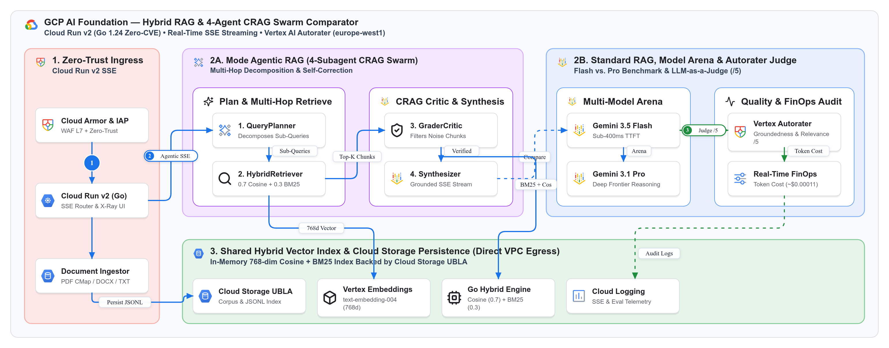
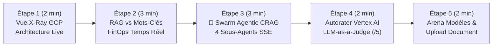

# 🎬 Guide de Démonstration Pas-à-Pas — `app-rag-comparison` (RAG Hybride & Swarm Agentic CRAG)

> 🌐 **[Read this Demo Playbook in English 🇬🇧](DEMO_PLAYBOOK-EN.md)** | 🏠 **[Retour au README Principal](../README.md)** | 🚀 **[Ouvrir la Démo Live](https://rag.hoffmannw.demo.altostrat.com)** | 🗺️ **[Schémas Dendrite v3.3 & Draw.io](architecture-gcpdraw.md)**


> 🎨 **Architecture Interactive Dendrite v3.3 (Bento Matrix 16:9)** : Vous pouvez basculer sur l'onglet **`🗺️ Schéma Interactif Dendrite v3.3`** directement dans la modale **`🏗️ Architecture GCP (X-Ray)`** de l'application, ou l'ouvrir plein écran dans [**Dendrite Studio ↗**](https://dendrite-758054785671.cr.gclb.goog/#code=dGhlbWU6ICJnY3AtYXJjaGl0ZWN0dXJlIgpyZW5kZXJPcmRlcjogbm9kZXMtZmlyc3QKZGlyZWN0aW9uOiByaWdodApzcGFjaW5nOiAyNgoKY29uc3QgR2NwQmx1ZSA9ICIjMWE3M2U4Igpjb25zdCBHY3BHcmVlbiA9ICIjMWU4ZTNlIgpjb25zdCBEYXJrU2xhdGUgPSAiIzIwMjEyNCIKY29uc3QgU3ViVGV4dCA9ICIjNWY2MzY4Igpjb25zdCBDYXJkQm9yZGVyID0gIiNkYWRjZTAiCmNvbnN0IFN1cmZhY2VXaGl0ZSA9ICIjZmZmZmZmIgoKU3R5bGUgQFByb2R1Y3RDYXJkIHsKICB3aWR0aDogMTk2LCBoZWlnaHQ6IDYwLAogIGZpbGw6ICRTdXJmYWNlV2hpdGUsIHN0cm9rZUNvbG9yOiAkQ2FyZEJvcmRlciwgc3Ryb2tlV2lkdGg6IDEsIGJvcmRlclJhZGl1czogOCwKICBmb250Q29sb3I6ICREYXJrU2xhdGUsIHN1YkZvbnRDb2xvcjogJFN1YlRleHQsCiAgZm9udFNpemU6IDEzLCBzdWJGb250U2l6ZTogMTAuNSwgbGFiZWxXZWlnaHQ6IGJvbGQsCiAgdGV4dEFsaWduOiAibGVmdCIsIHRleHRWQWxpZ246ICJtaWRkbGUiLAogIGljb25Qb3NpdGlvbjogImxlZnQiLCBpY29uU2l6ZTogMjYsIHBhZGRpbmc6IDEwLCBzaGFkb3c6IHRydWUKfQpTdHlsZSBAWm9uZUJsdWUgICB7IGZpbGw6ICIjZThmMGZlIiwgc3Ryb2tlOiAiIzViOWJmMyIsIGJvcmRlclJhZGl1czogMTIgfQpTdHlsZSBAWm9uZUdyZWVuICB7IGZpbGw6ICIjZTZmNGVhIiwgc3Ryb2tlOiAiIzY4Yjg4ZSIsIGJvcmRlclJhZGl1czogMTIgfQpTdHlsZSBAWm9uZVBlYWNoICB7IGZpbGw6ICIjZmNlOGU2Iiwgc3Ryb2tlOiAiI2YyOGI4MiIsIGJvcmRlclJhZGl1czogMTIgfQpTdHlsZSBAWm9uZVB1cnBsZSB7IGZpbGw6ICIjZjNlOGZkIiwgc3Ryb2tlOiAiI2ExNDJmNCIsIGJvcmRlclJhZGl1czogMTIgfQoKWm9uZSBAUkFHX0NvbXBhcmlzb25fQXJjaGl0ZWN0dXJlIHsKICB0aXRsZTogIkdDUCBBSSBGb3VuZGF0aW9uIOKAlCBIeWJyaWQgUkFHICYgNC1BZ2VudCBDUkFHIFN3YXJtIENvbXBhcmF0b3IiCiAgc3VidGl0bGU6ICJDbG91ZCBSdW4gdjIgKEdvIDEuMjQgWmVyby1DVkUpIOKAoiBSZWFsLVRpbWUgU1NFIFN0cmVhbWluZyDigKIgVmVydGV4IEFJIEF1dG9yYXRlciAoZXVyb3BlLXdlc3QxKSIKICBpY29uOiAiR29vZ2xlQ2xvdWQiLCBpY29uU2l6ZTogMjQKICBsYXlvdXQ6IG1hdHJpeCwgZ2FwOiAyNCwgcGFkZGluZzogMjQsIGFsaWduOiAic3RyZXRjaCIKICBmaWxsOiAiI2Y4ZmFmZCIsIHN0cm9rZTogIiNkYWRjZTAiLCBjb3JuZXJSYWRpdXM6IDE0CiAgYXJlYXM6IFsKICAgICJ1cHN0cmVhbSAgYXJjaEEgIGFyY2hCIiwKICAgICJ1cHN0cmVhbSAgc3RvcmUgIHN0b3JlIgogIF0KCiAgWm9uZSBAVXBzdHJlYW1fRWRnZSB7CiAgICB0aXRsZTogIjEuIFplcm8tVHJ1c3QgSW5ncmVzcyIKICAgIHN1YnRpdGxlOiAiQ2xvdWQgUnVuIHYyIFNTRSIKICAgIHN0eWxlOiBAWm9uZVBlYWNoLCBhcmVhOiAidXBzdHJlYW0iCiAgICBsYXlvdXQ6IGNvbHVtbiwgZ2FwOiAyMCwgcGFkZGluZzogMTgsIGFsaWduOiAiY2VudGVyIiwgaWNvbjogIkNsb3VkQXJtb3IiLCBpY29uU2l6ZTogMjAKICAgIFthcm1vcl9pYXA6ICJDbG91ZCBBcm1vciAmIElBUCIgfCAiV0FGIEw3ICsgWmVyby1UcnVzdCJdIHsgc3R5bGU6IEBQcm9kdWN0Q2FyZCwgaWNvbjogIkNsb3VkQXJtb3IiIH0KICAgIFtjbG91ZF9ydW5fZ286ICJDbG91ZCBSdW4gdjIgKEdvKSIgfCAiU1NFIFJvdXRlciAmIFgtUmF5IFVJIl0geyBzdHlsZTogQFByb2R1Y3RDYXJkLCBpY29uOiAiR2NwQ2xvdWRSdW4iIH0KICAgIFtkb2NfaW5nZXN0b3I6ICJEb2N1bWVudCBJbmdlc3RvciIgfCAiUERGIENNYXAgLyBET0NYIC8gVFhUIl0geyBzdHlsZTogQFByb2R1Y3RDYXJkLCBpY29uOiAiR2NwU3RvcmFnZUJ1Y2tldCIgfQogIH0KCiAgWm9uZSBAUGF0aF9BX0FnZW50aWNfQ1JBRyB7CiAgICB0aXRsZTogIjJBLiBNb2RlIEFnZW50aWMgUkFHICg0LVN1YmFnZW50IENSQUcgU3dhcm0pIgogICAgc3VidGl0bGU6ICJNdWx0aS1Ib3AgRGVjb21wb3NpdGlvbiAmIFNlbGYtQ29ycmVjdGlvbiIKICAgIHN0eWxlOiBAWm9uZVB1cnBsZSwgYXJlYTogImFyY2hBIgogICAgbGF5b3V0OiByb3csIGdhcDogMjIsIHBhZGRpbmc6IDE4LCBhbGlnbjogInN0cmV0Y2giLCBpY29uOiAiR29vZ2xlQWdlbnRzIiwgaWNvblNpemU6IDIwCgogICAgWm9uZSBAQ1JBR19QbGFuX1JldHJpZXZlIHsKICAgICAgdGl0bGU6ICJQbGFuICYgTXVsdGktSG9wIFJldHJpZXZlIiwgbGF5b3V0OiBjb2x1bW4sIGdhcDogMTYsIHBhZGRpbmc6IDE0LCBhbGlnbjogImNlbnRlciIsCiAgICAgIGZpbGw6ICIjZmZmZmZmIiwgc3Ryb2tlOiAiI2ExNDJmNCIsIGNvcm5lclJhZGl1czogMTAsIGljb246ICJTcGFya2xlcyIsIGljb25TaXplOiAxOAogICAgICBbYWdlbnRfcGxhbm5lcjogIjEuIFF1ZXJ5UGxhbm5lckFnZW50IiB8ICJEZWNvbXBvc2VzIFN1Yi1RdWVyaWVzIl0geyBzdHlsZTogQFByb2R1Y3RDYXJkLCBpY29uOiAiR29vZ2xlQWdlbnRzIiB9CiAgICAgIFthZ2VudF9yZXRyaWV2ZXI6ICIyLiBIeWJyaWRSZXRyaWV2ZXIiIHwgIjAuNyBDb3NpbmUgKyAwLjMgQk0yNSJdIHsgc3R5bGU6IEBQcm9kdWN0Q2FyZCwgaWNvbjogIlNlYXJjaCIgfQogICAgfQoKICAgIFpvbmUgQENSQUdfR3JhZGVfU3ludGhlc2l6ZSB7CiAgICAgIHRpdGxlOiAiQ1JBRyBDcml0aWMgJiBTeW50aGVzaXMiLCBsYXlvdXQ6IGNvbHVtbiwgZ2FwOiAxNiwgcGFkZGluZzogMTQsIGFsaWduOiAiY2VudGVyIiwKICAgICAgZmlsbDogIiNmZmZmZmYiLCBzdHJva2U6ICIjYTE0MmY0IiwgY29ybmVyUmFkaXVzOiAxMCwgaWNvbjogIlZlcnRleEFJIiwgaWNvblNpemU6IDE4CiAgICAgIFthZ2VudF9ncmFkZXI6ICIzLiBHcmFkZXJDcml0aWNBZ2VudCIgfCAiRmlsdGVycyBOb2lzZSBDaHVua3MiXSB7IHN0eWxlOiBAUHJvZHVjdENhcmQsIGljb246ICJTaGllbGRDaGVjayIgfQogICAgICBbYWdlbnRfc3ludGg6ICI0LiBDaXRhdGlvblN5bnRoZXNpemVyIiB8ICJHcm91bmRlZCBTU0UgU3RyZWFtIl0geyBzdHlsZTogQFByb2R1Y3RDYXJkLCBpY29uOiAiR2VtaW5pIiB9CiAgICB9CiAgfQoKICBab25lIEBQYXRoX0JfQXJlbmFfQW5kX0V2YWwgewogICAgdGl0bGU6ICIyQi4gU3RhbmRhcmQgUkFHLCBNb2RlbCBBcmVuYSAmIEF1dG9yYXRlciBKdWRnZSIKICAgIHN1YnRpdGxlOiAiRmxhc2ggdnMuIFBybyBCZW5jaG1hcmsgJiBMTE0tYXMtYS1KdWRnZSAoLzUpIgogICAgc3R5bGU6IEBab25lQmx1ZSwgYXJlYTogImFyY2hCIgogICAgbGF5b3V0OiByb3csIGdhcDogMjIsIHBhZGRpbmc6IDE4LCBhbGlnbjogInN0cmV0Y2giLCBpY29uOiAiVmVydGV4QUkiLCBpY29uU2l6ZTogMjAKCiAgICBab25lIEBNdWx0aU1vZGVsX0FyZW5hIHsKICAgICAgdGl0bGU6ICJNdWx0aS1Nb2RlbCBBcmVuYSIsIGxheW91dDogY29sdW1uLCBnYXA6IDE2LCBwYWRkaW5nOiAxNCwgYWxpZ246ICJjZW50ZXIiLAogICAgICBmaWxsOiAiI2ZmZmZmZiIsIHN0cm9rZTogIiM1YjliZjMiLCBjb3JuZXJSYWRpdXM6IDEwLCBpY29uOiAiR2VtaW5pIiwgaWNvblNpemU6IDE4CiAgICAgIFtnZW1pbmlfZmxhc2g6ICJHZW1pbmkgMy41IC8gMy44IEZsYXNoIiB8ICJTdWItNDAwbXMgVFRGVCJdIHsgc3R5bGU6IEBQcm9kdWN0Q2FyZCwgaWNvbjogIkdlbWluaSIgfQogICAgICBbZ2VtaW5pX3BybzogIkdlbWluaSAzLjEgUHJvIiB8ICJEZWVwIEZyb250aWVyIFJlYXNvbmluZyJdIHsgc3R5bGU6IEBQcm9kdWN0Q2FyZCwgaWNvbjogIlZlcnRleEFJIiB9CiAgICB9CgogICAgWm9uZSBAQXV0b3JhdGVyX0FuZF9GaW5vcHMgewogICAgICB0aXRsZTogIlF1YWxpdHkgJiBGaW5PcHMgQXVkaXQiLCBsYXlvdXQ6IGNvbHVtbiwgZ2FwOiAxNiwgcGFkZGluZzogMTQsIGFsaWduOiAiY2VudGVyIiwKICAgICAgZmlsbDogIiNmZmZmZmYiLCBzdHJva2U6ICIjNWI5YmYzIiwgY29ybmVyUmFkaXVzOiAxMCwgaWNvbjogIkFjdGl2aXR5IiwgaWNvblNpemU6IDE4CiAgICAgIFt2ZXJ0ZXhfYXV0b3JhdGVyOiAiVmVydGV4IEFJIEF1dG9yYXRlciIgfCAiR3JvdW5kZWRuZXNzICYgUmVsZXZhbmNlIC81Il0geyBzdHlsZTogQFByb2R1Y3RDYXJkLCBpY29uOiAiU2VjdXJpdHlDb21tYW5kQ2VudGVyIiB9CiAgICAgIFtmaW5vcHNfYmFkZ2U6ICJSZWFsLVRpbWUgRmluT3BzIiB8ICJUb2tlbiBDb3N0ICh+JDAuMDAwMTEpIl0geyBzdHlsZTogQFByb2R1Y3RDYXJkLCBpY29uOiAiQ2xvdWRCaWxsaW5nIiB9CiAgICB9CiAgfQoKICBab25lIEBTaGFyZWRfRGF0YV9Gb3VuZGF0aW9uIHsKICAgIHRpdGxlOiAiMy4gU2hhcmVkIEh5YnJpZCBWZWN0b3IgSW5kZXggJiBDbG91ZCBTdG9yYWdlIFBlcnNpc3RlbmNlIChEaXJlY3QgVlBDIEVncmVzcykiCiAgICBzdWJ0aXRsZTogIkluLU1lbW9yeSA3NjgtZGltIENvc2luZSArIEJNMjUgSW5kZXggQmFja2VkIGJ5IENsb3VkIFN0b3JhZ2UgVUJMQSIKICAgIHN0eWxlOiBAWm9uZUdyZWVuLCBhcmVhOiAic3RvcmUiCiAgICBsYXlvdXQ6IHJvdywgZ2FwOiAyMCwgcGFkZGluZzogMTgsIGFsaWduOiAiY2VudGVyIiwgaWNvbjogIkdjcERhdGFiYXNlIiwgaWNvblNpemU6IDIwCiAgICBbZ2NzX2NvcnB1c19idWNrZXQ6ICJDbG91ZCBTdG9yYWdlIFVCTEEiIHwgIkNvcnB1cyAmIEpTT05MIEluZGV4Il0geyBzdHlsZTogQFByb2R1Y3RDYXJkLCBpY29uOiAiR2NwU3RvcmFnZUJ1Y2tldCIgfQogICAgW3ZlcnRleF9lbWJlZGRpbmdzOiAiVmVydGV4IEVtYmVkZGluZ3MiIHwgInRleHQtZW1iZWRkaW5nLTAwNCAoNzY4ZCkiXSB7IHN0eWxlOiBAUHJvZHVjdENhcmQsIGljb246ICJBSVBsYXRmb3JtIiB9CiAgICBbaHlicmlkX2VuZ2luZTogIkdvIEh5YnJpZCBFbmdpbmUiIHwgIkNvc2luZSAoMC43KSArIEJNMjUgKDAuMykiXSB7IHN0eWxlOiBAUHJvZHVjdENhcmQsIGljb246ICJDcHUiIH0KICAgIFtjbG91ZF9sb2dnaW5nX2V2YWw6ICJDbG91ZCBMb2dnaW5nICYgVHJhY2UiIHwgIlNTRSAmIEV2YWwgVGVsZW1ldHJ5Il0geyBzdHlsZTogQFByb2R1Y3RDYXJkLCBpY29uOiAiQ2xvdWRMb2dnaW5nIiB9CiAgfQp9CgpbYXJtb3JfaWFwXSAtPiBbY2xvdWRfcnVuX2dvXSB7IHNvdXJjZUFuY2hvcjogImJvdHRvbSIsIHRhcmdldEFuY2hvcjogInRvcCIsIGNvbG9yOiAkR2NwQmx1ZSwgc3Ryb2tlV2lkdGg6IDIsIGN1cnZlOiAic3RlcCIsIHNlcXVlbmNlQmFkZ2U6ICIxIiwgYmFkZ2VGaWxsOiAkR2NwQmx1ZSwgYmFkZ2VGb250Q29sb3I6ICRTdXJmYWNlV2hpdGUgfQpbY2xvdWRfcnVuX2dvXSAtPiBbZG9jX2luZ2VzdG9yXSB7IHNvdXJjZUFuY2hvcjogImJvdHRvbSIsIHRhcmdldEFuY2hvcjogInRvcCIsIGNvbG9yOiAkR2NwQmx1ZSwgc3Ryb2tlV2lkdGg6IDIsIGN1cnZlOiAic3RlcCIgfQpbY2xvdWRfcnVuX2dvXSAtPiBbYWdlbnRfcGxhbm5lcl0geyBsYWJlbDogIkFnZW50aWMgU1NFIiwgc291cmNlQW5jaG9yOiAicmlnaHQiLCB0YXJnZXRBbmNob3I6ICJsZWZ0IiwgY29sb3I6ICRHY3BCbHVlLCBzdHJva2VXaWR0aDogMiwgY3VydmU6ICJzdGVwIiwgc2VxdWVuY2VCYWRnZTogIjIiLCBiYWRnZUZpbGw6ICRHY3BCbHVlLCBiYWRnZUZvbnRDb2xvcjogJFN1cmZhY2VXaGl0ZSB9ClthZ2VudF9wbGFubmVyXSAtPiBbYWdlbnRfcmV0cmlldmVyXSB7IGxhYmVsOiAiU3ViLVF1ZXJpZXMiLCBzb3VyY2VBbmNob3I6ICJib3R0b20iLCB0YXJnZXRBbmNob3I6ICJ0b3AiLCBjb2xvcjogJEdjcEJsdWUsIHN0cm9rZVdpZHRoOiAyLCBjdXJ2ZTogInN0ZXAiIH0KW2FnZW50X3JldHJpZXZlcl0gLT4gW2FnZW50X2dyYWRlcl0geyBsYWJlbDogIlRvcC1LIENodW5rcyIsIHNvdXJjZUFuY2hvcjogInJpZ2h0IiwgdGFyZ2V0QW5jaG9yOiAibGVmdCIsIGNvbG9yOiAkR2NwQmx1ZSwgc3Ryb2tlV2lkdGg6IDIsIGN1cnZlOiAic3RlcCIgfQpbYWdlbnRfZ3JhZGVyXSAtPiBbYWdlbnRfc3ludGhdIHsgbGFiZWw6ICJWZXJpZmllZCIsIHNvdXJjZUFuY2hvcjogImJvdHRvbSIsIHRhcmdldEFuY2hvcjogInRvcCIsIGNvbG9yOiAkR2NwQmx1ZSwgc3Ryb2tlV2lkdGg6IDIsIGN1cnZlOiAic3RlcCIgfQoKW2FnZW50X3N5bnRoXSAtPiBbZ2VtaW5pX2ZsYXNoXSB7IGxhYmVsOiAiQ29tcGFyZSIsIHNvdXJjZUFuY2hvcjogInJpZ2h0IiwgdGFyZ2V0QW5jaG9yOiAibGVmdCIsIGNvbG9yOiAkR2NwQmx1ZSwgc3Ryb2tlV2lkdGg6IDEuOCwgZGFzaGVkOiB0cnVlLCBjdXJ2ZTogInN0ZXAiIH0KW2dlbWluaV9mbGFzaF0gLT4gW2dlbWluaV9wcm9dIHsgbGFiZWw6ICJBcmVuYSIsIHNvdXJjZUFuY2hvcjogImJvdHRvbSIsIHRhcmdldEFuY2hvcjogInRvcCIsIGNvbG9yOiAkR2NwQmx1ZSwgc3Ryb2tlV2lkdGg6IDEuOCwgY3VydmU6ICJzdGVwIiB9CltnZW1pbmlfZmxhc2hdIC0+IFt2ZXJ0ZXhfYXV0b3JhdGVyXSB7IGxhYmVsOiAiSnVkZ2UgLzUiLCBzb3VyY2VBbmNob3I6ICJyaWdodCIsIHRhcmdldEFuY2hvcjogImxlZnQiLCBjb2xvcjogJEdjcEdyZWVuLCBzdHJva2VXaWR0aDogMiwgY3VydmU6ICJzdGVwIiwgc2VxdWVuY2VCYWRnZTogIjMiLCBiYWRnZUZpbGw6ICRHY3BHcmVlbiwgYmFkZ2VGb250Q29sb3I6ICRTdXJmYWNlV2hpdGUgfQpbdmVydGV4X2F1dG9yYXRlcl0gLT4gW2Zpbm9wc19iYWRnZV0geyBsYWJlbDogIlRva2VuIENvc3QiLCBzb3VyY2VBbmNob3I6ICJib3R0b20iLCB0YXJnZXRBbmNob3I6ICJ0b3AiLCBjb2xvcjogJEdjcEdyZWVuLCBzdHJva2VXaWR0aDogMS44LCBjdXJ2ZTogInN0ZXAiIH0KCltkb2NfaW5nZXN0b3JdIC0+IFtnY3NfY29ycHVzX2J1Y2tldF0geyBsYWJlbDogIlBlcnNpc3QgSlNPTkwiLCBzb3VyY2VBbmNob3I6ICJib3R0b20iLCB0YXJnZXRBbmNob3I6ICJsZWZ0IiwgY29sb3I6ICRHY3BCbHVlLCBzdHJva2VXaWR0aDogMiwgY3VydmU6ICJzdGVwIiB9ClthZ2VudF9yZXRyaWV2ZXJdIC0+IFt2ZXJ0ZXhfZW1iZWRkaW5nc10geyBsYWJlbDogIjc2OGQgVmVjdG9yIiwgc291cmNlQW5jaG9yOiAiYm90dG9tIiwgdGFyZ2V0QW5jaG9yOiAidG9wIiwgY29sb3I6ICRHY3BCbHVlLCBzdHJva2VXaWR0aDogMiwgY3VydmU6ICJzdGVwIiB9ClthZ2VudF9ncmFkZXJdIC0+IFtoeWJyaWRfZW5naW5lXSB7IGxhYmVsOiAiQk0yNSArIENvcyIsIHNvdXJjZUFuY2hvcjogImJvdHRvbSIsIHRhcmdldEFuY2hvcjogInRvcCIsIGNvbG9yOiAkR2NwQmx1ZSwgc3Ryb2tlV2lkdGg6IDIsIGN1cnZlOiAic3RlcCIgfQpbZmlub3BzX2JhZGdlXSAtPiBbY2xvdWRfbG9nZ2luZ19ldmFsXSB7IGxhYmVsOiAiQXVkaXQgTG9ncyIsIHNvdXJjZUFuY2hvcjogImJvdHRvbSIsIHRhcmdldEFuY2hvcjogInRvcCIsIGNvbG9yOiAkR2NwR3JlZW4sIHN0cm9rZVdpZHRoOiAxLjgsIGRhc2hlZDogdHJ1ZSwgY3VydmU6ICJzdGVwIiB9Cg==) ([`.dendrite`](diagrams/rag_comparison_crag_v3.dendrite) / [`.drawio`](diagrams/rag_comparison_crag_v3.drawio)).
Ce document est le **conducteur de démonstration pas-à-pas** pour présenter le comparateur **RAG Hybride vs Swarm Agentic CRAG (4 sous-agents) vs Recherche Lexicale** hébergé sur **Google Cloud Run** (`europe-west1`).

Chaque étape détaille :
1. **🖱️ Action à réaliser** (bouton 1-Click dans l'UI ou commande CLI)
2. **🤖 Quel Agent / Service GCP entre en action** (sous le capot)
3. **👀 Ce qu'il faut observer à l'écran & 💡 Message clé client (Valeur GCP)**

---

[](diagrams/rag_comparison_crag_v3.png)

## ⏱️ Vue d'Ensemble du Scénario (Durée : 10 à 12 min)



---

## 🔹 Étape 1 : Ouvrir la Radiographie Temps Réel (`🏗️ Architecture GCP (X-Ray)`)

### 1. 🖱️ Action à réaliser
1. Ouvrir **[`https://rag.hoffmannw.demo.altostrat.com`](https://rag.hoffmannw.demo.altostrat.com)**.
2. Cliquer en haut à droite sur le bouton bleu **`🏗️ Architecture GCP (X-Ray)`**.

### 2. 🤖 Quels Services GCP sont présentés sous le capot
La modale affiche les 6 briques traversées par chaque requête :
1. **Cloud Armor WAF & IAP** (Zero-Trust L7 OWASP Top 10)
2. **Cloud Run v2 (Go 1.24)** (Serverless, Direct VPC Egress, streaming SSE `text/event-stream`)
3. **Swarm Agentic CRAG** (4 sous-agents : `QueryPlanner` ➔ `HybridRetriever` ➔ `GraderCritic` ➔ `CitationSynthesizer`)
4. **Recherche Hybride (0.7 / 0.3)** (Vecteurs 768-dim `text-embedding-004` + score lexical BM25)
5. **Cloud Storage (GCS UBLA)** (Persistance automatique du corpus et de l'index JSONL)
6. **Autorater LLM-as-a-Judge & FinOps** (Audit d'ancrage `/5` et coût par requête `~$0.00012`).

### 3. 👀 Ce qu'il faut observer & 💡 Message clé client
- **À l'écran** : Chaque brique comporte un **Deep-Link 1-Click** qui ouvre directement la ressource correspondante dans la Console Google Cloud (`wh-ai-blueprint-a363`).
- **💡 Message clé client** : *« Tout ce démonstrateur tourne en Serverless pur sur Cloud Run v2 en Belgique (`europe-west1`), sans aucune clé JSON statique grâce à Workload Identity / ADC. »*

---

## 🔹 Étape 2 : RAG Hybride vs Recherche par Mots-Clés & Coût FinOps Temps Réel

### 1. 🖱️ Action à réaliser
Au-dessus de la barre de saisie en bas de l'écran, cliquer sur la pilule **Démo 1-Click** :
> **`💰 FinOps & RAG vs Mots-Clés`**
*(Question injectée automatiquement : « Quels sont les seuils d'alerte budgétaire FinOps et comment optimiser les coûts d'inférence Gemini ? » en mode `RAG vs Recherche`)*

### 2. 🤖 Ce qui se passe sous le capot
- **Colonne de gauche (RAG Hybride Vertex AI)** :
  1. Calcul de l'embedding 768-dim de la question via `text-embedding-004`.
  2. Fusion **70% Similarité Cosinus + 30% BM25 Lexical**.
  3. Génération en streaming SSE via **Gemini 3.5 Flash** avec citations explicites `[Source: ...]`.
- **Colonne de droite (Recherche Classique)** :
  - Simple correspondance de mots-clés retournant des extraits bruts non synthétisés.

### 3. 👀 Ce qu'il faut observer & 💡 Message clé client
- **À l'écran** :
  - Les **pilules de Grounding** affichent le score hybride exact (`%`) et le détail au survol (`Sémantique vs BM25`).
  - La barre de télémétrie affiche en direct : `⚡ 1er token: ~380ms | Total: ~1200ms | 💰 FinOps: ~$0.00011`.
- **💡 Message clé client** : *« Là où la recherche classique oblige l'collaborateur à lire 10 documents PDF, le RAG Hybride Google Cloud synthétise la réponse exacte en moins d'une seconde pour un coût inférieur à un centième de centime d'euro. »*

---

## 🔹 Étape 3 : Déclencher le Swarm `🤖 Agentic RAG` (4 Sous-Agents CRAG)

### 1. 🖱️ Action à réaliser
Cliquer sur la pilule **Démo 1-Click** ambrée au-dessus de la zone de saisie :
> **`🤖 Multi-Hop Agentic CRAG (4 Agents)`**
*(Question multi-domaine injectée : « Compare les règles de sécurité Cloud Armor WAF, la politique de rétention WORM Backup DR et les seuils d'alerte FinOps »)*

*(Alternative en CLI : `make demo-agentic`)*

### 2. 🤖 Quels Sous-Agents entrent en action sous le capot (`src/agentic_rag.go`)
Le mode **`🤖 Agentic RAG`** compare côte à côte le **Swarm CRAG (4 sous-agents)** (à gauche) et le **RAG Standard Single-Shot** (à droite) :
1. **`QueryPlannerAgent` (🧠 Planificateur)** : Décompose la question complexe en 3 sous-requêtes atomiques ciblées (`[#1] Cloud Armor WAF`, `[#2] Backup DR WORM`, `[#3] Budget FinOps`).
2. **`HybridRetrieverAgent` (🔍 Chasseur Documentaire)** : Exécute la recherche hybride multi-passe en parallèle et déduplique les passages.
3. **`GraderCriticAgent` (⚖️ Critique CRAG)** : Évalue la pertinence de chaque extrait trouvé et filtre le bruit documentaire avant d'appeler le LLM.
4. **`CitationSynthesizerAgent` (✍️ Rédacteur)** : Produit la synthèse finale consolidée avec citations croisées.

### 3. 👀 Ce qu'il faut observer & 💡 Message clé client
- **À l'écran** : Le panneau **`Orchestration Multi-Agents (Swarm CRAG — 4 Sous-Agents)`** s'anime étape par étape en temps réel (`agent_step` SSE) avec la latence en millisecondes de chaque sous-agent et les sous-requêtes générées.
- **💡 Message clé client** : *« Sur une question transversale touchant à 3 domaines (Sécurité, Sauvegarde WORM et FinOps), un RAG classique à 1 seule passe oublie souvent un aspect. Le pattern Agentic CRAG sur Vertex AI décompose le problème, vérifie ses propres sources et garantit une couverture exhaustive. »*

---

## 🔹 Étape 4 : Audit Qualité par `LLM-as-a-Judge` (`Vertex AI Autorater`)

### 1. 🖱️ Action à réaliser
Sous la réponse générée par le modèle, cliquer sur le bouton violet :
> **`⚖️ Évaluer la réponse (Vertex AI Autorater)`**

*(Alternative en CLI : `make demo-evaluate`)*

### 2. 🤖 Quel Agent / Service entre en action sous le capot (`POST /api/evaluate`)
Le backend appelle **Vertex AI Rapid Evaluation (`Autorater`)** qui agit comme un juge indépendant (`LLM-as-a-Judge`) sur deux métriques officielles notées de **1.0 à 5.0** :
- **Ancrage (`Groundedness`)** : Vérifie que 100% des affirmations proviennent strictement des passages documentaires extraits (zéro hallucination).
- **Pertinence (`Answer Relevance`)** : Vérifie que la réponse traite intégralement la question posée.

### 3. 👀 Ce qu'il faut observer & 💡 Message clé client
- **À l'écran** : Apparition de la carte de score global (ex: `4.9 / 5 ★★★★★`) avec un accordéon **`Consulter l'audit et le raisonnement de l'Autorater`** détaillant la justification chaîne-de-pensée du juge.
- **💡 Message clé client** : *« Vous n'avez plus besoin de croire l'IA sur parole : Vertex AI intègre un auditeur automatique qui mesure mathématiquement le taux d'ancrage et bloque toute hallucination. »*

---

## 🔹 Étape 5 : Arena Modèles (`Flash vs Pro`) & Indexation Temps Réel

### 1. 🖱️ Action à réaliser
1. Cliquer sur la pilule **`⚖️ Arena Modèles (Flash vs Pro)`** pour lancer une course en direct entre **Gemini 3.5 Flash** et **Gemini 3.8 Flash / 3.1 Pro**.
2. Dans la barre latérale gauche (**Corpus Documentaire**), cliquer sur **`Ajouter un document à la volée`** pour téléverser un fichier PDF/TXT/DOCX et observer la barre de progression + la persistance immédiate sur Cloud Storage (`gs://...-rag-docs`).
3. En terminal, montrer la validation Gatekeeper M1L1 :
   ```bash
   make verify
   ```
