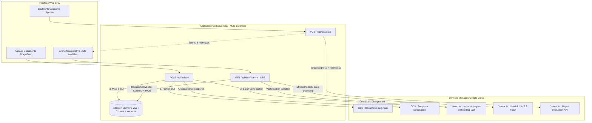

# Document de Design Architectural : Évolution RAG Comparison Chatbot

*Date : 15 Septembre 2026*  
*Statut : Validé (Phase Brainstorming terminée)*  
*Auteurs : William Hoffmann & Jetski Pair Programming*

---

## 1. Contexte & Objectifs

L'application **RAG Comparison Chatbot** offre une arène visuelle interactive pour comparer les performances de modèles génératifs (Gemini 2.5 Flash vs Gemini 3.8 Flash) en contexte documentaire (RAG).

Jusqu'à présent, l'application reposait sur un stockage purement éphémère en mémoire vive et un moteur de recherche exclusivement lexical par mots-clés, déployée sur une instance unique Cloud Run (`--max-instances=1`).

Ce document formalise les spécifications techniques de l'architecture cible, construite autour de **trois piliers majeurs validés** :
1. **Persistance & Scalabilité** : Déport du corpus documentaire vers Cloud Storage (GCS) et chargement d'un snapshot d'index au démarrage, permettant l'auto-scaling Cloud Run multi-instances.
2. **Recherche Hybride (Dense + Sparse)** : Vectorisation sémantique avec Vertex AI Embeddings (`text-multilingual-embedding-002`) combinée au scoring lexical BM25 en mémoire pure.
3. **Benchmarking & Évaluation GenAI à la demande** : Intégration de l'API Vertex AI Rapid Evaluation pour scorer objectivement l'ancrage documentaire (*Groundedness*) et la pertinence (*Relevance*) via un bouton d'évaluation sous chaque modèle.

---

## 2. Architecture Globale du Système



---

## 3. Spécifications Détaillées par Bloc

### Bloc 1 — Persistance GCS & Déverrouillage Multi-Instances

#### Stockage
- **Bucket cible** : `wh-ai-blueprint-a363-ai-demo-2e2m-rag-docs` (configurable via la variable d'environnement `GCS_RAG_BUCKET`).
- **Documents bruts** : Stockés sous `documents/{document_id}/{filename}`.
- **Index unifié** : Fichier sérialisé `index/corpus.json` contenant la liste des documents, chunks découpés, métadonnées et vecteurs d'embeddings associés.

#### Mécanisme de Synchronisation
- **Démarrage (Cold Start)** : Au boot de l'instance Cloud Run, chargement en mémoire vive de `index/corpus.json`. Si le fichier n'existe pas encore, initialisation d'un corpus vide.
- **Écriture (Upload / Suppression)** :
  1. Mise à jour de la structure locale sous verrou mutex (`sync.RWMutex`).
  2. Écriture du document brut sur GCS.
  3. Sérialisation et écriture atomique de `index/corpus.json` sur GCS avec précondition `If-Generation-Match` pour la cohérence entre instances.
- **Scalabilité Cloud Run** : Passage de `--max-instances=1` à `--max-instances=10`. Zéro perte de données en cas de scale-to-zero.

---

### Bloc 2 — Recherche Hybride (Sémantique + Lexicale)

#### Modèle d'Embeddings
- **Modèle retenu** : `text-multilingual-embedding-002` (Vertex AI Endpoint).
- **Dimensionnalité** : 768 dimensions en `float32`.
- **Taille de chunk** : ~800 caractères avec recouvrement (*overlap*) de 150 caractères.

#### Ingestion & Vectorisation
- À l'upload, découpage du texte extrait en chunks.
- Appel par lots (*batch prediction*) à Vertex AI Embeddings pour vectoriser l'ensemble des chunks du document en une seule passe.
- Les vecteurs sont attachés aux chunks en RAM et persistés dans `corpus.json`.

#### Requête & Fusion Hybride
1. **Vectorisation de la requête** : 1 appel unitaire à Vertex AI Embeddings sur le prompt utilisateur.
2. **Score Sémantique** : Calcul du produit scalaire (similarité cosinus) entre la requête et chaque chunk :
   $$\text{Sim}_{\text{cos}}(q, c) = \frac{q \cdot c}{\|q\| \|c\|} \in [0, 1]$$
3. **Score Lexical** : Normalisation du score de matching par mots-clés / BM25 existant :
   $$\text{Score}_{\text{lex}} \in [0, 1]$$
4. **Combinaison Linéaire** :
   $$\text{Score}_{\text{final}} = 0.65 \times \text{Sim}_{\text{cos}} + 0.35 \times \text{Score}_{\text{lex}}$$
5. **Top-K Chunks** : Sélection des $K=5$ meilleurs extraits injectés dans le contexte de grounding des deux modèles.
6. **Fallback de Résilience** : En cas d'erreur ou d'indisponibilité du quota d'embeddings, bascule immédiate et transparente sur le scoring lexical à 100%.

---

### Bloc 3 — Évaluation GenAI à la demande

#### API & Métriques
- **Point d'entrée backend** : `POST /api/evaluate`.
  ```json
  {
    "query": "Qu'est-ce que l'anarchie selon Kropotkine ?",
    "model": "gemini-2.5-flash",
    "answer": "...",
    "sources": ["extrait chunk 1", "extrait chunk 2"]
  }
  ```
- **Service Google Cloud** : Vertex AI Gen AI Evaluation Service (`projects.locations.evaluations`).
- **Métriques calculées** :
  - `Groundedness` (Ancrage) : Score de 1 à 5 mesurant si les affirmations sont attestées par les sources.
  - `Answer Relevance` (Pertinence) : Score de 1 à 5 mesurant l'adéquation de la réponse à la question.

#### Interface Utilisateur (UI)
- Sous chaque réponse terminée dans l'arène : affichage d'un bouton `⚖️ Évaluer`.
- Au clic : loader discret sans bloquer l'interaction.
- Résultat : Badges d'évaluation avec code couleur (vert si $\ge 4/5$, orange si $\ge 3/5$, rouge sinon) et infobulle d'explication.

---

## 4. Plan de Découpage des Travaux

| Lot | Intitulé | Tâches Principales | Livrables |
| :--- | :--- | :--- | :--- |
| **Lot 1** | **Persistance GCS** | Intégration client Cloud Storage Go, upload brut, sérialisation `corpus.json`, cold-start loader, tests unitaires. | Corpus persistant, passage à `--max-instances=5`. |
| **Lot 2** | **Recherche Hybride** | Intégration API Embeddings Vertex AI, calcul cosinus en Go, fusion 65/35, badge d'affichage de score de pertinence hybride. | Résultats sémantiques robustes sur synonymes et requêtes conceptuelles. |
| **Lot 3** | **Évaluation GenAI** | Endpoint `/api/evaluate`, intégration Vertex Evaluation, bouton dans la colonne d'arène, badges Groundedness & Relevance. | Banc de test d'évaluation scientifique intégré. |
